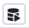

# Curso de Backend con NodeJS: base de datos con PostgreSQL

Esta es la cuarta parte de un grupo de cursos Platzi que están relacionados.

1. [Curso Práctico de FrontEnd developer.](https://github.com/andreiarriaza/online-shop-html-css)
2. [Curso de React JS.](https://github.com/andreiarriaza/online-shop-react)
3. [Curso de BackEnd con NodeJS: API REST con Express JS](https://github.com/andreiarriaza/nodeJS/tree/main/2.%20Backend-NodeJS-API-Rest-Express)
4. Curso de BackEnd con NodeJS: base de datos con PostgreSQL.

## ¿Qué es PostgreSQL?

PostgreSQL, también llamado Postgres, es un sistema de gestión de bases de datos relacional orientado a objetos y de código abierto, publicado bajo la licencia PostgreSQL,1​ similar a la BSD o la MIT.

Como muchos otros proyectos de código abierto, el desarrollo de PostgreSQL no es manejado por una empresa o persona, sino que es dirigido por una comunidad de desarrolladores que trabajan de forma desinteresada, altruista, libre o apoyados por organizaciones comerciales.

## ¿Qué es Docker?

Docker es un software de código abierto utilizado para desplegar aplicaciones dentro de contenedores virtuales. La contenerización permite que varias aplicaciones funcionen en diferentes entornos complejos. Por ejemplo, Docker permite ejecutar el sistema de gestión de contenidos WordPress en sistemas Windows, Linux y macOS sin ningún problema.

Aunque Docker y las máquinas virtuales tienen un propósito similar, su rendimiento, compatibilidad con el sistema operativo (SO) y portabilidad difieren significativamente.

La principal diferencia es que los contenedores Docker comparten el sistema operativo del anfitrión, mientras que las máquinas virtuales tienen un sistema operativo invitado que se ejecuta sobre el sistema anfitrión. Este método de funcionamiento afecta al rendimiento, las necesidades de hardware y la compatibilidad con el sistema operativo.

## Instalar Docker

Para su instalación se deben seguir los siguientes pasos:

1. Descargar Docker desde el sitio oficial: https://www.docker.com/
2. Al final de la instalación, dejar activadas los checkbox:
   - Use WSL 2 instead of Hyperv-V
   - Add shortcut to desktop
3. Abrir Docker y aceptar los términos y condiciones. Luego, acceder a:

   - Settings.
   - Resources.
   - WSL Integration
   - Luego, asegurarse que esté activado el Checkbox:
     _**Enable integration with my default WSL distro**_

4. Si la versión de Kernel de Linux está desactualidazada en la computadora, al abrir docker se despliega una ventana emergente que mostrará un mensaje en la que se indica que es necesario actualizar la versión de "WSL 2". Para realizar esta actualización, solo se deben seguir los pasos que se brindan en el link que se muestra en la ventana que se desplegó: https://learn.microsoft.com/es-es/windows/wsl/install-manual#step-4---download-the-linux-kernel-update-package

5. Listo.

## Asociar base de datos de PostgreSQl a Docker

1. Crear el archivo "docker-compose.yml", y agregar el código que se encuentra dentro del servicio llamado "postgres", el cual está en el archivo antes mencionado:

```yml
# Acá puede colocarse el nombre de la base de datos,  sin embargo, como buena práctica, se acostumbra colocar el nombre del servicio que se utilizará, en este caso, el servicio se llama: postgre.
# IMPORTANTE: Este servicio se descargará y ejecutará por medio de Docker.
postgres:
  # (opcional) Se le asigna el nombre al contenedor. Puede ser cualquier nombre, en este caso, se le asignó el mismo nombre del servicio, pero esto puede cambiar sin ningún problema.
  container_name: postgres
  # Se define la versión de PostgreSQL que se usará (correrá) en este contenedor. Si se agrega el comando "latest", se define que se desea trabajar con la versión más reciente de PostgreSQL. Si se deseara una versión en específico, se puede escribir directamente el número de versión deseado.

  # IMPORTANTE: el atributo "image", sirve para indicar lo que es necesario descargar para el funcionamiento del servicio. En este caso, se necesita "postgres" y se eligió la versión más reciente (latest).
  image: postgres:latest

  # Se definen las variables de entorno (environment), las cuales son las que permiten indicar la configuración inicial que se le asignará a la imagen. En las variables de entorno puede ir, por ejemplo, la siguiente información: nombre de base de datos, usuario, password, etc.
  environment:
    # El comando "POSTGRES_DB" sirve para definir el nombre de la base de datos deseada.
    - POSTGRES_DB=my_store

      # Se define el nombre de usuario.
    - POSTGRES_USER=walter

      # Se define la contraseña del usuario respectivo.
    - POSTGRES_PASSWORD=123

  # Se define el puerto en el que se ejecutará PostgresSQL. Normalmente PostgreSQL se ejecuta en el puerto "5432".
  ports:
    # Este servicio correrá en el puerto de la computadora "5432" (primer valor).
    # Internamente, correrá en el puerto "5432" del contenedor (segundo valor).
    - 5432:5432

  volumes:
    # Los contenedores NO TIENEN ESTADO. Esto significa que al detener la ejecución de un contenedor, toda la información se borrará. Esto es precisamente lo contrario de lo que se busca conseguir usando bases de datos, pues es indispensable que la información de la base de datos persista (se almacene) aún después de que el contenedor de Docker se haya detenido. Para corregir este problema, es necesario agregar el atributo "volumen" al archivo "docker-compose.yml".

    # Se define en qué lugar se desea almacenar la información de la base de datos del contenedor. Se almacenará en la carpeta "progress_data" del proyecto actual.La información del contenedor se almacenará internamente en la carpeta:
    # /var/lib/postgres/data

    # Esta ruta es específica para "postgreSQL". La ruta para MariaDB o
    # para MySQL son diferentes.
    - ./postgres_data:/var/lib/postgresql/data
```

2. Levantar el contenedor que se creó en el archivo "docker-compose.yml", es necesario ejecutar el siguiente comando:

```bash
# El comando "up" hace referencia a que se desea levantar el contenedor.
# El comando "-d" sirve para que el contenedor se ejecute en segundo plano.
# Se define el nombre del servicio asociado al contenedor que se desea levantar. Se debe recordar,
# que dentro del archivo "docker-compose.yml" se definió un servicio con el nombre de "postgres".
docker-compose up -d postgres
```

**IMPORTANTE:** si se despliega una ventana, en la que pide confirmar si se desea que el Firewall de Windows permita realiar las modificaciones hechas por Docker. Dar clic en Aceptar.

3. Para corroborar cuáles son los contenedores levantados que existen, se utiliza el comando:

```bash
docker-compose ps
```

4. Para cerrar o detener la ejecución de un contenedor, se usa el comando:

```bash
docker-compose down
```

---

**IMPORTANTE:** Si los pasos **5 al 7** se ejecutaron anteriormente en la aplicación, no es necesario repetirlos.

---

5. Activar el subsistema de Linux en Windows, ejecutando en la consola Power Shell (como administrador) el siguiente comando (ver [link](https://github.com/apoorvpandey-ap/Docker_1/issues/1)):

```bash
dism.exe /online /enable-feature /featurename:Microsoft-Windows-Subsystem-Linux /all /norestart
```

6. Activar la característica de Windows "Hyper-V" la cual sirve para crear máquinas virtuales en Windows. Hay dos maneras de realizar esto:

   a. Ejecutar el comando:

   ```bash
   Enable-WindowsOptionalFeature -Online -FeatureName Microsoft-Hyper-V -All
   ```

   b. Activar por medio del Panel de Control:

   - Panel de Control
   - Programas
   - Dentro de la sección "Programas y características", seleccionar la opción "Activar o desactivar las características de Windows".
   - En la ventana que se despliega, buscar la carpeta "Hyper-v" y activar las opciones "Herramientas de administración de Hyper-V" y "Plataforma de "Hyper-V".
   - Clic en el botón "Aceptar" en todas las ventanas.

7. Abrir _**Docker Desktop**_. Se debería iniciar correctamente. Si se muestra el mensaje de que "Docker" no se inició apropiadamente, es necesario revisar si se realizaron correctamente los pasos del 5 al 7 correctamente.

**Si Docker no se inicia correctamente:**

**IMPORTANTE 2:** Los contenedores NO TIENEN ESTADO. Esto significa que al detener la ejecución de un contenedor, toda la información se borrará. Esto es precisamente lo contrario de lo que se busca conseguir usando base de datos, pues es indispensable que la información de la base de datos persista (se almacene) aún después de que el contenedor de Docker se haya detenido. Para corregir este problema, es necesario agregar el atributo "volumen" al archivo "docker-compose.yml".

## Asociar base de datos de MySQL a Docker

1. Crear el archivo "docker-compose.yml", y agregar el código que se encuentra dentro del servicio llamado "mysql", el cual está en el archivo antes mencionado:

```yml
mysql:
  # (opcional) Se le asigna el nombre al contenedor. Puede ser
  # cualquier nombre, en este caso, se le asignó el mismo nombre del servicio,
  # pero esto puede cambiar sin ningún problema.
  container_name: mysql
  # IMPORTANTE: el atributo "image", sirve para indicar lo que es necesario descargar para el funcionamiento del servicio. En este caso, se necesita "mysql" y se eligió la versión "5".

  # Se define la versión de PostgreSQL que se usará (correrá) en este contenedor. Si se agrega el comando "latest", se define que se desea trabajar con la versión más reciente de PostgreSQL. Si se deseara una versión en específico, se puede escribir directamente el número de versión deseado.
  image: mysql:5

  # Se definen las variables de entorno (environment), las cuales son las que permiten indicar la configuración inicial que se le asignará a la imagen. En las variables de entorno puede ir, por ejemplo, la siguiente información: nombre de base de datos, usuario, password, etc.

  environment:
    # ¡¡¡IMPORTANTE!!!: estos valores deben coincidir con los que se encuentran asignados dentro del archivo ".env", EXCEPTO las variables "MYSQL_USER" y "MYSQL_PORT", estas sí deben cambiar.
    # La variable "MYSQL_DATABASE" sirve para definir el nombre de la base de datos deseada.
    - MYSQL_DATABASE=my_store

      # Se define el nombre de usuario.
    - MYSQL_USER=root

    # Se define la contraseña del usuario respectivo.
    - MYSQL_ROOT_PASSWORD=123

    # EL Sistema de Gestión de Bases de Datos MySQL exige que se defina también, como variable de entorno, el puerto a través del cual se realizará la comunicación con la base de datos. El puerto en el que generalmente corre MySQL es el "3306".
    - MYSQL_PORT=3306

    # Se define el puerto en el que se ejecutará MySQL. Normalmente MySQL se ejecuta en el puerto "3306".
  ports:
    # Este servicio correrá en el puerto de la computadora "33061" (primer valor).
    # Internamente, correrá en el puerto "3306" del contenedor (segundo valor).
    - 33061:3306

  volumes:
    # Los contenedores NO TIENEN ESTADO. Esto significa que al detener la ejecución de un contenedor, toda la información se borrará. Esto es precisamente lo contrario de lo que se busca conseguir usando bases de datos, pues es indispensable que la información de la base de datos persista (se almacene) aún después de que el contenedor de Docker se haya detenido. Para corregir este problema, es necesario agregar el atributo "volumen" al archivo "docker-compose.yml".

    # Se define en qué lugar se desea almacenar la información de la base de datos del contenedor. Se almacenará en la carpeta "mysql_data" del proyecto actual.La información del contenedor se almacenará internamente en la carpeta:
    # /var/lib/mysql

    # Esta ruta es específica para "MySQL". La ruta para MariaDB o para PostgreSQL son diferentes.
    - ./mysql_data:/var/lib/mysql
```

2. Levantar el contenedor que se creó en el archivo "docker-compose.yml", es necesario ejecutar el siguiente comando:

```bash
# El comando "up" hace referencia a que se desea levantar el contenedor.
# El comando "-d" sirve para que el contenedor se ejecute en segundo plano.
# Se define el nombre del servicio asociado al contenedor que se desea levantar. Se debe recordar,
# que dentro del archivo "docker-compose.yml" se definió un servicio con el nombre de "postgres".
docker-compose up -d postgres
```

**IMPORTANTE:** si se despliega una ventana, en la que pide confirmar si se desea que el Firewall de Windows permita realiar las modificaciones hechas por Docker. Dar clic en Aceptar.

3. Para corroborar cuáles son los contenedores levantados que existen, se utiliza el comando:

```bash
docker-compose ps
```

4. Para cerrar o detener la ejecución de un contenedor, se usa el comando:

```bash
docker-compose down
```

---

**IMPORTANTE:** Si los pasos **5 al 7** se ejecutaron anteriormente en la aplicación, no es necesario repetirlos.

---

5. Activar el subsistema de Linux en Windows, ejecutando en la consola Power Shell (como administrador) el siguiente comando (ver [link](https://github.com/apoorvpandey-ap/Docker_1/issues/1)):

```bash
dism.exe /online /enable-feature /featurename:Microsoft-Windows-Subsystem-Linux /all /norestart
```

6. Activar la característica de Windows "Hyper-V" la cual sirve para crear máquinas virtuales en Windows. Hay dos maneras de realizar esto:

   a. Ejecutar el comando:

   ```bash
   Enable-WindowsOptionalFeature -Online -FeatureName Microsoft-Hyper-V -All
   ```

   b. Activar por medio del Panel de Control:

   - Panel de Control
   - Programas
   - Dentro de la sección "Programas y características", seleccionar la opción "Activar o desactivar las características de Windows".
   - En la ventana que se despliega, buscar la carpeta "Hyper-v" y activar las opciones "Herramientas de administración de Hyper-V" y "Plataforma de "Hyper-V".
   - Clic en el botón "Aceptar" en todas las ventanas.

7. Abrir _**Docker Desktop**_. Se debería iniciar correctamente. Si se muestra el mensaje de que "Docker" no se inició apropiadamente, es necesario revisar si se realizaron correctamente los pasos del 5 al 7 correctamente.

**Si Docker no se inicia correctamente:**

**IMPORTANTE 2:** Los contenedores NO TIENEN ESTADO. Esto significa que al detener la ejecución de un contenedor, toda la información se borrará. Esto es precisamente lo contrario de lo que se busca conseguir usando base de datos, pues es indispensable que la información de la base de datos persista (se almacene) aún después de que el contenedor de Docker se haya detenido. Para corregir este problema, es necesario agregar el atributo "volumen" al archivo "docker-compose.yml".

## Conectarse a la base de datos manejada por el Sistema de Gestión de Bases de Datos "PostgreSQL"

1. Abrir Docker.

2. Levantar el contenedor que se creó en el archivo "docker-compose.yml", es necesario ejecutar el siguiente comando:

```bash
# El comando "up" hace referencia a que se desea levantar el contenedor.
# El comando "-d" sirve para que el contenedor se ejecute en segundo plano.
# Se define el nombre del servicio asociado al contenedor que se desea levantar. Se debe recordar,
# que dentro del archivo "docker-compose.yml" se definió un servicio con el nombre de "postgres".
docker-compose up -d postgres
```

3. Para corroborar cuáles son los contenedores levantados que existen, se utiliza el comando:

```bash
docker-compose ps
```

4. Ejecutar el comando:

```bash
# El comando "exec" hace referencia a "execute" (ejecutar).
# El comando "bash", indica que deseamos conectarnos a una terminal en bash.
# Se define el nombre del servicio o contenedor que se ejecutará.

docker-compose exec nombreContenedor bash
```

Ejemplo:

```bash
# En este caso, el contenedor se llama "postgres".
docker-compose exec postgres bash
```

5. Una vez dentro del contenedor, es decir, una vez que se está ejecutando el contenedor, es necesario conectarse a la base de datos deseada por medio del siguiente comando:

```bash
psql -h localhost -d nombreBaseDatos -U nombreUsuariuo

```

Ejemplo:

```bash
psql -h localhost -d my_store -U walter
```

- psql: comando de PostgreSQL que permite ejecutar comandos.
- h: indica que se definirá el host al que se desea conectarse.
- localhost: indica que el host con el que se realizará la conexión es nuestra propia computadora.
- d: sirve para indicar a qué base de datos se desea conectarse.
- my_store (ejemplo): es el nombre que en este ejemplo se le dio a la base de datos. Este nombre debe reemplazarse por el nombre de la base de datos que corresponda.
- U: sirve para definir el usuario de la base de datos que se definió en el archivo "docker-compose.yml".
- walter (ejemplo): en este ejemplo, el usuario se llama "walter". Este usuario se debe reemplazar por el nombre de usuario que se asignó en el archivo "docker-compose.yml".

6. Cuando se desee salir de la base de datos actual, se debe usar el comando:

```bash

\q
```

7. Cuando se desee salir del contendor actual, se debe utilizar el comando:

```bash
exit
```

## Comandos útiles para Docker

1. ls -l Permite listar todos los archivos del contenedor de Docker.
2. \d+ Permite obtener la estructura de la base de datos.
3. \q Salir de la base de datos actual.
4. exit Salir del contenedor actual.
5. docker ps Devuelve el listado de contenedores incluyendo el **id** de cada contenedor (este comando es parecido al comando `docker-compose ps`, con la diferencia de que este último no muestra el **id** del contenedor).
6. docker inspect idContendor Despliega la información del contendor cuyo **id** (idContenedor) se indicó al ejecutar el comando. Dentro de esta información se encuentra la **IPAdress**, es decir, la **IP** asociada a ese contenedor.

## pgAdmin: Interfaz gráfica para trabajar con PostgreSQL

Aunque hay varias opciones de interfaz gráfica para _**PostgreSQL**_, se usará la interfaz _**pgAdmin**_ la cual es gratuita y permite ser usada por medio del navegador.

### Como configurar pgAdmin en Docker

Para poder usar la imagen de 'pgAdmin' es fundamental hacer lo siguiente:

1. Solo para comprobar la versión más reciente de "pgadmnin", se debe acceder al sitio web: https://hub.docker.com/search?q=pgadmin
2. Comprobar cuál es la primera opción de descarga, en este ejemplo, la versión más reciente es: _**dpage/pgadmin4**_ _** (**este paquete no debe descargarse, de eso se encargará Docker**)**_

3. Se debe agregar el servicio _**pgadmin**_ al archivo _**docker-compose.yml**_, lo cual se consigue agregando los siguientes valores al archivo mencionado:

```yml
# Este servicio permitirá utilizar la interfaz gráfica para trabajar con
# PostgreSQL, la cual se llama "pgAdmin".
# IMPORTANTE: Este servicio se descargará y ejecutará por medio de Docker.
pgadmin:
  # (opcional) Se le asigna el nombre al contenedor. Puede ser
  # cualquier nombre, en este caso, se le asignó el mismo nombre del servicio,
  # pero esto puede cambiar sin ningún problema.
  container_name: pgadmin

  # Para poder usar la imagen de 'pgAdmin' es fundamental hacer lo siguiente:
  # 1. Acceder al sitio web:
  #  https://hub.docker.com/search?q=pgadmin
  # 2. Seleccionar la primera opción de descarga, en este ejemplo, la
  # versión más reciente es: dpage/pgadmin4
  # 3. Ejecutar el servicio:
  # docker-compose up -d pgadmin

  # IMPORTANTE: para corroborar que los servicios
  # se están ejecutando correctamente, se usa el comando:
  # docker-compose ps

  # Al definir la imagen, se puede definir la versión específica de "pgadmin",
  # como se muestra en la siguiente línea:
  # image: dpage/pgadmin4

  # Si no se desea definir la versión específica,
  # se puede indicar que se desea trabajar con la versión más reciente
  # utililzando la palabra "latest":
  image:
    dpage/pgadmin4
    # Se definen las variables de entorno (envirnoment), las cuales son las que permiten indicar la configuración
    # inicial que se le asignará a la imagen.
  environment:
    # Se le asigna un correo electrónico por default. El correo
    # puede ser inventado.
    - PGADMIN_DEFAULT_EMAIL=admin@mail.com
    # Se define una contraseña asociada al correo electrónico anterior.
    - PGADMIN_DEFAULT_PASSWORD=root

  ports:
    # Este servicio correrá en el puerto de la computadora "5050".
    # Internamente, correrá en el puerto "80" del contenedor.
    - 5050:80

    # IMPORTANTE: en este servicio NO es necesario definir un atributo
    # "volumes" (volúmenes), porque este servicio no necesita
    # persistencia de datos. El único servicio que necesita persistencia,
    # es el servicio "postgres", el cual contiene la base de datos.
```

3. Ejecutar el servicio con el siguiente comando:

```bash
     docker-compose up -d pgadmin
```

IMPORTANTE: para corroborar que los servicios se están ejecutando correctamente, se usa el comando:

```bash
docker-compose ps
```

**IMPORTANTE:** Si por alguna razón el servicio _**pgadmin**_ no se ejecuta correctamente, se debe seguir intentando, hasta que se muestre en la lista obtenida por medio del comando `docker-compose ps`.

4. Acceder en el navegador al puerto asociado al servicio _**pgadmin**_. En este caso, en el archivo _**docker-compose.yml**_ se indicó que el archivo al que se conectará el servicio _**pgadmin**_ es el **5050**. Por lo que, para poder acceder a _**pgAdmin**_ en el navegador, se debe escribir la siguiente URL: **http://localhost:5050/**. En esta página web se debe escribir tanto el _**email**_ como el _**password**_ asociados al servicio _**pgadmin**_ que se definieron en el archivo _**docker-compose.yml**_.

Para acceder al sitio web mencionado, en lo que respecta a este ejemplo, los datos son los siguientes:

- Email: admin@mail.com
- Password: root

5. Cuando se haya accedido con el email y contraseña antes indicados, ya se puede visualiza la interfaz gráfica de _**pgAdmin**_. Ahora es necesario registrar el servidor de _**postgreSQL**_ con el que se desea establecer la conexión, lo cual se hará en los siguientes pasos.

6. Acceder a menú "Object".
7. Seleccionar la opción "Register".
8. Elegir la opción "Server".
9. Se abre un cuadro de diálogo. En la ficha _**General**_ se debe agregar en la casilla _**Name**_ el nombre que se desea dar al servidor. En este ejemplo, se le asignó el nombre: _**MyStore**_
10. En el mismo cuadro de diálogo, seleccionar la ficha _**Connection**_. Y agregar los siguientes datos:

- Host name/adress: aquí se puede escribir la IP del contenedor en el que se está corriendo PostgreSQL, sin embargo, NO ES RECOMENDABLE usar la IP del contenedor, ya que esta IP cambia cuando el contenedor se destruye. Lo recomendable es agregar acá el nombre del contenedor de _**postgreSQL**_ con el que se desea establecer la conexión. En este caso, en el archivo _**docker-compose.yml**_ se definió que el contenedor que almacena el servicio de _**postgreSQL**_ se llama: _**postgres**_.

- Port: acá se escribe el puerto que está asociado al contenedor que almacena el servicio de _**postgreSQL**_. En este caso, el contenedor _**postgres**_ se conecta al puerto **5432**.

- Maintenance database: nombre de la base de datos con la que se desea conectarse. En este caso se llama: _**my_store**_.

- Username: se escribe el nombre de usuario que se asoció al servicio de _**postgreSQL**_ que se creó en Docker por medio del archivo _**docker-compose.yml**_. En este caso, dicho servicio se llama _**postgres**_ y tiene asociado el nombre de usuario: **walter**.

- Password: se escribe el password que se asoció al servicio de _**postgreSQL**_ que se creó en Docker por medio del archivo _**docker-compose.yml**_. En este caso, dicho servicio se llama _**postgres**_ y tiene asociado el password: **123**.

  Ejemplo:

  ```txt
  Host name/adress: postgres
  Port: 5432
  Maintenance database: my_store
  Username: walter
  Password: 123

  ```

11. Se debe activar la casilla _**Save password**_ para que la contraseña sea guardada.
12. Dar clic en el botón _**Save**_.

13. Listo. Ahora es posible ejecutar consultas en la base de datos.

## Integración de Node JS con PostgreSQL

Para realizar la integración de Node JS con PostgreSQL se utilizará la librería _**node-postgres**_ cuyo sitio oficial es: https://node-postgres.com/

Esta librería es una colección de módulos que corren con Node JS, los cuales permiten usar promesas y callbacks de forma asíncrona. De forma resumida, es un Controlador de PostgreSQL para Node JS.

Para realizar la isntalación de _**node-postgres**_ es necesario seguir los siguientes pasos:

1. Instalar node-postgres por medio del comando: `npm install pg`
2. Se crea una carpeta dentro del proyecto, con el nombre deseado. En este caso se nombrará _**libs**_. Dentro de ella se almacenarán las librerías que permiten la conexión con terceros, ya sean API's o bases de datos.
3. Dentro de la carpeta _**libs**_ se crea el archivo _**postgres.js**_.
4. Dentro del sitio web de _**[node-postgres](https://node-postgres.com/)**_
   se encuentra la sección _**Geting started**_ , dentro de la cual se encuentra un ejemplo de cómo implementar Node JS con PostgresSQL. Tomando como referencia dicho código, se adecuará a lo que se necesita en esta aplicación, y se agregará dentro del archivo _**postgres.js**_ recién creado:

```js
/* Se importa el módulo "pkg" de la librería "pg" (node-postgres). Luego, se desestructura a partir de ella la constante "Client". */
const { Client } = require("pg");

async function getConnection() {
  /*
Para realizar la conexión con la base de datos, se crea una instancia
de la clase "Client()".
*/
  const client = new Client({
    /* Se define la configuración de la conexión.
    - host: se indica el nombre del servidor en el que se encuentra la base
            de datos. En este caso, como todo se está trabajando con Docker, se le asigna el valor: "localhost".

    - port: sirve para indicar en qué puerto está corriendo la base de datos.
            En este caso, es en el puerto "5432", el cual es el mismo que se definió en el contenedor "postgres" que se creó en el archivo "docker-compose.yml".
    - user: nombre del usuario de la base de datos. Nuevamente, es el mismo
            usuario que se definió en el contenedor "postgres" que se creó en el archivo "docker-compose.yml".

    - password: password asociado a la base de datos.
                Nuevamente, es el mismo password que se definió en el contenedor "postgres" que se creó en el archivo "docker-compose.yml".
    - database: nombre de la base de datos. Es el mismo nombre que se definió
                en el contenedor "postgres" que se creó en el archivo "docker-compose.yml".

  */
    host: "localhost",
    port: 5432,
    user: "walter",
    password: "123",
    database: "my_store",
  });

  /* Se realiza la conexión mediante el método "connect()". Pero como dicho método devuelve una promesa, se puede correr de forma asíncrona. Por ello, la función "getConnection()" fue declarada asíncrona (async), y también por ello, en la siguiente línea se utiliza el comando "await". */
  await client.connect();
}

/* Se exporta la función "getConnection()". */
module.exports = getConnection;
```

## Abrir pgAdmin y ejecutar consultas

1. Para que todo funcione correctamente, deben estar inicializados los contenedores de _**Docker**_ que correspondan. En este caso, se deben haber inicializado los contendores _**postgres**_ y _**pgadmin**_:

```bash
  docker-compose up -d postgres
  docker-compose up -d pgadmin
```

2. Luego, es necesario obtener el puerto al que se está conectando el contenedor llamado _**pgadmin**_. Para conocerlo, es necesario obtener el puerto al que se conecta el contenedor _**pgadmin**_. Para obtener dicho puerto, hay dos métodos:

- **Primer método:** acceder al archivo _**docker-compose.py**_ y buscar el servicio (contenedor) llamado _**pgadmin**_. Luego, dentro de dicho servicio, buscar el número de puerto asignado. El cual es, en este caso, el **5050**.

- **Segundo método:** ejecutar el comando `dockerc-compose ps`. Al ejecutarlo, se mostrará la lista de contendores de Docker que se están ejecutando actualmente. En este ejemplo, mostraría lo siguiente:

```bash
NAME                IMAGE               COMMAND                  SERVICE             CREATED             STATUS              PORTS

pgadmin             dpage/pgadmin4      "/entrypoint.sh"         pgadmin             24 hours ago        Up 10 minutes       443/tcp, 0.0.0.0:5050->80/tcp

postgres            postgres:latest     "docker-entrypoint.s…"   postgres            24 hours ago        Up About an hour    0.0.0.0:5432->5432/tcp
```

En el despliegue anterior, se puede ver que en la última columna aparecen los puertos de conexión (PORTS) del contenedor respectivo. Cuando se ubica el contenedor "pgadmin", se comprueba que, en este ejemplo, dicho contendor se conecta al puerto **5050**. Ese número de puerto es el que servirá para acceder, desde el navegador a _**pgAdmin**_.

2. Abrir el navegador y escribir la siguiente URL, según el número de puerto al que esté conectado el contenedor _**pgadmin**_ en _**Docker**_:

```
http://localhost:puertoContedorPgAdmin/
```

En este ejemplo, dicha URL queda así:

```bash
# Porque el puerto al que se conecta el contenedor "pgadmin" es, en este caso, el 5050.
http://localhost:5050/

```

3. Luego de acceder, se debe mostrar la ventana de inicio de sesión de _**pgAdmin**_. En esa ventana se debe escribir tanto el usuario como la contraseña que se definieron en el **paso 3 del tema [Como configurar pgAdmin en Docker](#como-configurar-pgadmin-en-docker)** que se detalló anteriormente.

En este ejemplo, dichos datos de inicio de sesión son:

- **usuario:** admin@mail.com
- _**password:**_ root

4. Para poder agregar código SQL para ejecutar consultas en _**pgAdmin**_, se debe seleccionar en el panel _**Browser**_ que se encuentra a la izquierda de la ventana de _**pgAdmin**_, la base de datos en la que se quiere realizar las consultas SQL.

En este ejemplo, al dar clic dentro del panel _**Browser**_ en la carpeta **Servers**, se debe seleccionar el nombre del servidor deseado; en este caso, se le asignó el nombre _**MyStore**_. A continuación, se debe elegir el nombre de la base de datos que corresponda; en este caso, se llama _**my_store**_.

Una vez seleccionada la base de datos deseada, se debe dar clic en el botón _**Query tool**_ que se encuentra en la parte superior derecha del panel _**Browser**_:



### Crear tablas

1. Para acceder a la herramienta _**Query tool**_, la cual permite agregar código SQL para ejecutar consultas en _**pgAdmin**_, se debe seleccionar en el panel _**Browser**_ que se encuentra a la izquierda de la ventana de _**pgAdmin**_, la base de datos en la que se quiere realizar las consultas SQL.

En este ejemplo, al dar clic dentro del panel _**Browser**_ en la carpeta **Servers**, se debe seleccionar el nombre del servidor al que se desea conectarse, el cual, en este caso, se llama _**MyStore**_. A continuación, se debe dar clic en la opción _**Databases**_ y luego elegir el nombre de la base de datos que corresponda, la cual en este ejemplo se llama _**my_store**_.

Una vez seleccionada la base de datos deseada, se debe dar clic en el botón _**Query tool**_ que se encuentra en la parte superior derecha del panel _**Browser**_:


2. Agregar la estructura de la tabla deseada; en este caso, se utilizó la siguiente:

```sql
CREATE TABLE tasks (
  /* El valor "serial" indica que este campo será autoincremental (se incrementará automáticamente). */
	id serial PRIMARY KEY,
	title VARCHAR(255) NOT NULL,
	/* El campo "completed" tiene asignado el valor "false" por defecto. */
	completed boolean DEFAULT false


	);
```

### Ver tablas creadas

1. Desde el panel :**Browser**: dar clic en _**Servers**_.
2. Dar clic en el servidor deseado. En este caso, en _**MyStore**_.
3. Seleccionar _**Databases**_.
4. Elegir la base de datos deseada. En este caso, se llama _**my_store**_.
5. Seleccionar _**Schemas**_.
6. Elegir la opción _**Tables**_.

### Listar todos los campos de una tabla

Cuando se hace referencia a una tabla, _**pgAdmin**_ requiere que el nombre de la tabla vaya precedido del comando `public.`. En este caso, como la tabla se llama _**tasks**_, se hace referencia a ella por medio del comando `public.tasks`.

```sql
SELECT * FROM public.tasks ORDER BY id ASC
```

### Agregar registros a una tabla

1. Ejecutar una sentencia que permita ver los datos de una tabla. En este caso, se ejecutó la sentencia:

```sql
SELECT * FROM public.tasks ORDER BY id ASC

```

Esta sentencia mostrará los nombres de los campos ordenados de forma ascendente por _**id**_. Aunque la tabla está vacía, en el panel de la parte inferior aparece la estructura de la tabla y se mostrará los campos que se asignaron a la tabla _**tasks**_ que se creó anteriormente. En este caso, dichos campos son: _**id, title y completed**_.

2. En el panel de la parte inferio, se debe dar clic en el botón _**Add row**_. Al dar clic, se agregará una fila para agregar el primer registro.

- El campo _**id**_ se dejará en blanco porque se desea que se incremente automáticamente (por eso, cuando se creó la tabla se le asignó el valor _**serial**_).
- En el campo _**title**_ se escribe el título de la tarea que se desea agregar.
- El campo _**completed**_ se deja vacío, pues se configuró la tabla para que su valor predeterminado sea _**false**_.

Una vez agregados todos los registros deseados, se debe dar clic en el botón _**Save Data Changes**_ que se encuentra también en el panel inferior.

3. Listo.

```sql
/* Esta tabla contiene los campos "id", "title" y "completed". */
CREATE TABLE tasks (
	id serial PRIMARY KEY,
	title VARCHAR(255) NOT NULL,
	/* El campo "completed" tiene asignado el valor "false" por defecto. */
	completed boolean DEFAULT false
);
```

3. Para corroborar que la tabla se creó correctamente se debe acceder a la siguiente ruta dentro del panel _**Browser**_:

- Servers
- MyStore (en este caso, el servidor se llama así)
- Databases
- my_store (en este caso, ese es el nombre dado a la base de datos)
- Schemas
- Tables
- (Seleccionar la tabla deseada)

4. Otra opción es corroborar desde la consola si la tabla fue creada. Para ello se deben escribir los siguientes comandos:

```bash
# Een este caso, el servicio se llama 'postgres'.
docker-compose exec postgres bash
# En este ejemplo, el usuario es 'walter'.
psql -h localhost -d my_store -U walter

# Este comando permite visualizar la estructura de la base de datos.
\d+
```

## phpmyadmin: Interfaz gráfica para trabajar con MySQL

Para trabajar con _**MySQL**_, se usará la interfaz _**phpmyadmin**_ la cual es gratuita y permite ser usada por medio del navegador.

### Como configurar phpMyAdmin en Docker

Para poder usar la imagen de 'pgAdmin' es fundamental hacer lo siguiente:

1. Se debe agregar el servicio _**phpmyadmin**_ al archivo _**docker-compose.yml**_, lo cual se consigue agregando los siguientes valores al archivo mencionado:

```yml
# Este servicio llamdo "phpmyadmin" permitirá utilizar la interfaz gráfica para trabajar con MySQL. IMPORTANTE: Este servicio se descargará y ejecutará por medio de Docker. "phpmyadmin" es un entorno gráfico para MySQL.
phpmyadmin:
  # (opcional) Se le asigna el nombre al contenedor. Puede ser cualquier nombre, en este caso, se le asignó el mismo nombre del servicio, pero esto puede cambiar sin ningún problema.
  container_name: phpmyadmin

  # Al definir la imagen, se puede definir la versión específica de "pgadmin", como se muestra en la siguiente línea:
  # image: dpage/pgadmin4

  # IMPORTANTE: el atributo "image", sirve para indicar lo que es necesario descargar para el funcionamiento del servicio. En este caso, se necesita "phpmyadmin".
  # Si no se desea definir la versión específica, se puede indicar que se desea trabajar con la versión más reciente utililzando la palabra "latest".
  image: phpmyadmin/phpmyadmin

  environment:
    # Se define una contraseña asociada al correo electrónico anterior.
    - MYSQL_ROOT_PASSWORD=root

    # Indica en qué host está corriendo la base de datos de MySQL. Se define como host, el nombre del servicio con el cual será asociado, en este caso el servicio "mysql".
    - PMA_HOST=mysql
  # Se define en qué puerto se desea que corra el entorno gráfico
  ports:
    # Este servicio correrá en el puerto de la computadora "8080" (primer valor).
    # Internamente, correrá en el puerto "80" del contenedor (segundo valor).
    - 8080:80
```

2. Ejecutar el servicio con el siguiente comando:

```bash
     docker-compose up -d phpmyadmin
```

IMPORTANTE: para corroborar que los servicios se están ejecutando correctamente, se usa el comando:

```bash
docker-compose ps
```

**IMPORTANTE:** Si por alguna razón el servicio _**phpmyadin**_ no se ejecuta correctamente, se debe seguir intentando, hasta que se muestre en la lista obtenida por medio del comando `docker-compose ps`.

3. Acceder en el navegador al puerto asociado al servicio _**phpmyadmin**_. En este caso, en el archivo _**docker-compose.yml**_ se indicó que el archivo al que se conectará el servicio _**phpymyadmin**_ es el **8080**. Por lo que, para poder acceder a _**phpmyadmin**_ en el navegador, se debe escribir la siguiente URL: **http://localhost:8080/**. En esta página web se debe escribir tanto el _**usuario**_ como la _**contraseña**_ asociados al servicio _**mysql**_ que se definieron en el archivo _**docker-compose.yml**_.

Para acceder al sitio web mencionado, en lo que respecta a este ejemplo, los datos son los siguientes:

- Usuario: root
- Contraseña: 123

4. Listo. Ahora es posible ejecutar consultas en la base de datos.

## Enviar peticiones a la API mediante POSTMAN

Para probar el envío de una petición GET a la API, se deben seguir los siguientes pasos:

1. Abrir Docker en la computadora.

2. Como siempre, inicializar el contenedor de _**Docker**_. Como en este proyecto, para comprobar la versatilidad de _**Docker**_ se instalaron dos diferentes Sistemas de Gestión de Bases de Datos en sus respectivos contenedores, se tienen dos opciones:

- Primera opción: es necesario inicializar el contenedor _**Docker**_ que tiene asignado el nombre _**postgres**_ (Sistema de Gestión de Base de Datos). También es necesario inicializar el contenedor _**Docker**_ que tiene asignado el nombre _**pgadmin**_ (interfaz gráfica). Esto se consigue mediante los siguientes comandos:

  ```bash
  docker-compose up -d nombreContenedor

  ```

  Ejemplo:

  ```bash
  docker-compose up -d postgres
  docker-compose up -d pgadmin
  ```

- Segunda opción: es necesario inicializar el contenedor _**Docker**_ que tiene asignado el nombre _**mysql**_ (Sistema de Gestión de Base de Datos). También es necesario inicializar el contenedor _**Docker**_ que tiene asignado el nombre _**phpmyadmin**_ (interfaz gráfica). Esto se consigue mediante los siguientes comandos:

  Ejemplo:

  ```bash
  docker-compose up -d mysql
  docker-compose up -d phpmyadmin
  ```

3. En la misma consola, ejecutar el comando `node index.js`. El cual permitirá iniciar _**Node JS**_ en la aplicación actual.
   _**¡¡¡¡¡IMPORTANTE!!!!!:**_ El comando "npm run dev" es equivalente (porque así se configuró en el archivo "package.json") al comando "node index.js". POr lo que si aparece algún error similar a este: "el puerto 3000 se encuentra ocupado", es causado porque probablemente se ejecutó antes el comando "npm run dev", y luego se quiere ejecutar el comando "node index.js" directamente, o viceversa. TOMARLO EN CUENTA.
4. Acceder a _**POSTMAN**_, crear una nueva petición (request) de tipo _**GET**_ y agregar, por ejemplo, el _**endpoint**_: http://localhost:3000/api/v1/users
5. Al realizar el envío de la petición, se obtendrán los datos de la tabla que corresponda (si los hubiera). En este caso, se consultó la tabla "tasks" de la base de datos "my_store".

## Pool de conexiones

Un pool de conexiones es un conjunto limitado de conexiones a una base de datos, que es manejado por un servidor de aplicaciones de forma tal, que dichas conexiones pueden ser reutilizadas por los diferentes usuarios.

Ejemplo:


Cada vez que se invoca, por ejemplo, la función asíncrona _**getConnection()**_, ubicada en el archivo _**postgres.js**_, se está generando una conexión nueva con la base de datos. Lo que significa que cada vez que se invoque dicha función se están creando nuevas conexiones que terminarán consumiendo recursos. Para corregir esto, _**pgAdmin**_ tiene una interfaz de _**Pooling**_ la cual permite manejar varias conexiones, pero reutilizando a través de toda la aplicación la misma conexión.
pgAdmin

## Usar Pool por medio de "node-postgres"

Si está trabajando en una aplicación web u otro software que realiza consultas frecuentes, querrá usar un grupo de conexiones.

La forma más fácil y, con mucho, la más común de usar node-postgres es a través de un grupo de conexiones.

La conexión de un nuevo cliente al servidor PostgreSQL requiere un apretón de manos que puede tardar entre 20 y 30 milisegundos. Durante este tiempo, se negocian las contraseñas, se puede establecer SSL y la información de configuración se comparte con el cliente y el servidor. Incurrir en este costo cada vez que queremos ejecutar una consulta ralentizaría sustancialmente nuestra aplicación.

Al acceder al sitio web de _**node_postgres**_, se puede visualizar, del lado izquierdo, un panel con los diferentes _**features**_ o funcionalidades que tiene disponibles esta librería. En este caso, se usará la funcionalidad de _**Pooling**_, la cual se encuentra explicada en la siguiente _**URL**_: https://node-postgres.com/features/pooling

Para implementar el _**Pooling**_ en esta aplicación, se deben seguir los siguientes pasos:

1. Crear el archivo _**postgres.pool.js**_.
2. Agregar dentro del archivo anterior, un código como el siguiente:

```js
/* Se importa el módulo "pkg" de la librería "pg" (node-postgres). Luego, se desestructura a partir de ella la constante "Pool". */
const { Pool } = require("pg");

/* Se importa el archivo "config.js", el cual contiene las variables de entorno que,
por seguridad, fueron creadas en él. */
const { config } = require("./../config/config.js");

/* Es sugerido proteger las variables de entorno que sean delicadas, codificándolas. Esto se logra mandando un URL con todo el esquema de conexión por medio del método "encodeURIComponent()"

La función encodeURIComponent() en javascript codifica un componente de un componente URI (Identificador uniforme de recursos) reemplazando cada copia de un carácter determinado con una o más secuencias de escape que representan la codificación UTF-8 del carácter en cuestión.

URI significa Identificador de Recurso Uniforme (Uniform Resourse Identifier).

Cualquier cosa que excepcionalmente identifique un recurso es su URI como id, nombre, o número ISBN.

*/

/* ***** Las variables de entorno "dbUser" y "dbPassword" se consideran delicadas, por lo tanto serán codificadas o protegidas. ***** */

/* Se codifica la variable de entorno "dbUser". */
const USER = encodeURIComponent(config.dbUser);
/* Se codifica la variable de entorno "dbPassword". */
const PASSWORD = encodeURIComponent(config.dbPassword);

/* Se comenzará a obtener la URL completa de conexión. */

/* Cuando se desea conectar la aplicación a una base de datos remota, por ejemplo en Amazon, Heroku, Digital Ocean, etc., no proporcionan los datos: host, port, user, password, database de forma directa, sino que proporcionan una URL de Conexión.

En este ejemplo, a continuación se conformará una URL de Conexión.
*/

/* La constante "URI" almacenará la "URL de Conexión". */

/* ************ URL de Conexión ************ */
/* La URL de Conexión tiene las siguientes partes:
      - postgres://  Es el protocolo con el que se conectará a PostgresSQL
      - USER: es el usuario que se codificó anteriormente.
      - PASSWORD: el password que se configuró anteriormente.
      - dbHost: la variable de entorno "dbHost" que fue creada en el archivo "config.js".
      - dbPort: la variable de entorno "dbPort" que fue creada en el archivo "config.js".
      - dbName: la variable de entorno "dbName" que fue creada en el archivo "config.js".
*/
const URI = `postgres://${USER}:${PASSWORD}@${config.dbHost}:${config.dbPort}/${config.dbName}`;

/*
Para realizar la conexión con la base de datos, se crea una instancia
de la clase "Pool()".
*/
const pool = new Pool({
  /* Se define la configuración de la conexión por medio de la .
    - host: se indica el nombre del servidor en el que se encuentra la base
            de datos. En este caso, como todo se está trabajando con Docker, se le asigna el valor: "localhost".

    - port: sirve para indicar en qué puerto está corriendo la base de datos.
            En este caso, es en el puerto "5432", el cual es el mismo que se definió en el contenedor "postgres" que se creó en el archivo "docker-compose.yml".
    - user: nombre del usuario de la base de datos. Nuevamente, es el mismo
            usuario que se definió en el contenedor "postgres" que se creó en el archivo "docker-compose.yml".

    - password: password asociado a la base de datos.
                Nuevamente, es el mismo password que se definió en el contenedor "postgres" que se creó en el archivo "docker-compose.yml".
    - database: nombre de la base de datos. Es el mismo nombre que se definió
                en el contenedor "postgres" que se creó en el archivo "docker-compose.yml".

  */

  /* El atributo "connectionString" es reconocido por el _**Pool**_ de conexiones, y sirve para poder indicar cuál será la URL (cadena) de conexión.

  Luego, se le pasa como valor la constante URI que se declaró justo arriba. */
  connectionString: URI,
});

/* Se exporta la instancia "pool". */
module.exports = pool;
```

En este caso, se agregaron los datos antes indicados para conectarse con la base de datos, pero estos deben reemplazarse por los datos que correspondan a la base de datos con la que se quiera establecer el _**Pool**_.

3. Luego, importarlo e implementarlo en el lugar desedado. En este caso, se recomienda ver cómo se implemento este _**Pool**_ en el archivo _**productService.js**_; y específicamente cuando se declaró la función asíncrona _**find()**_.

## Crear variables de entorno (ambiente) en Node JS

Al inicio de la construcción de este proyecto, se utilizaron variables como el usuario, la contraseña, etc., para poder acceder a la base de datos, se han escrito dentro del código, lo cual es una mala práctica. Lo recomendable es manejar esos datos por medio de variables de entorno en Node JS.

Las variables de entorno se utilizan para almacenar contenido sensible

Para crear variables de entorno se deben seguir los siguientes pasos:

1. Crear carpeta llamada _**config**_.
2. Dentro de ella se crea el archivo _**config.js**_.
3. Dentro del archivo anterior agregar el siguiente código:

```js
/* Se importa el paquete "dotenv". */

/* El paquete "dotenv" se encarga de leer el archivo "env" que se creó anteriormente. Se debe recordar que las variables de entorno se pueden agregar directamente al archivo
"package.json", sin embargo, com en esta ocasión se creó el archivo ".env"  este paquete permite que dicho archivo sea leído y carga automáticamente cada una de las variables en el "process" (process.env: este comando es el que permite leer las variables de entorno de Node) de Node JS. */
// import the "dotenv" package
require("dotenv").config();

/* Este archivo sirve para configurar las variables de entorno que se
utilizarán en este proyecto. */
const config = {
  /*

  env: el atributo "env" sirve para indicar en qué entorno nos encontramos.
    - process.env: es el comando utilizado por Node JS para leer variables de entorno.
    - NODE_ENV: es una variable de entorno de Node que indica en qué entorno está el
                usuario.

                Se agregó un operador de cortocircuito para comprobar si se detecta el entorno en el que está el usuario; si lo detecta, ese entorno se asignará al atributo "env", pero, si no lo detecta, se asignará de forma predeterminada el entorno 'dev' (desarrollador).

  port: el atributo "port" permite definir el puerto en el que se va a ejecutar la
        aplicación.
        PORT: es una variable de entorno de Node que devuelve el puerto en el que se está corriendo una aplicación.
  */
  /*
  Cortocircuito OR(||):
    Cuando el valor de la izquierda en la expresión
    sea igual a "true", dicho valor de la izquierda será el
    valor que se agregará, de lo contrario, si el valor de la
    izquierda es igual a "false" el valor que
    se agregará será el de la derecha.
  */
  env: process.env.NODE_ENV || "dev",
  /* Si no se detecta un puerto, se asignará de forma predeterminada el puerto "3000". */
  port: process.env.NODE_PORT || 3000,

  /* ************* Configuración de base de datos ************* */
  /*
  dbUser: el atributo "dbUser" permite definir el usuario de la base datos.
        DB_USER: es una variable de entorno de Node que devuelve el usuario de la base de datos.
  */
  dbUser: process.env.DB_USER,
  /* Clave de la base de datos. */
  dbPassword: process.env.DB_PASSWORD,
  /* Nombre del "host" con el que se conectará la base de datos. */
  dbHost: process.env.DB_HOST,
  /* Nombre de la base de datos. */
  dbName: process.env.DB_NAME,
  /* Puerto por medio del cual se conectará la base de datos. */
  dbPort: process.env.DB_PORT,
};

module.exports = { config };
```

4. Acceder al archivo _**postgres.pool.js**_ e importar el archivo _**config.js**_. Luego, se recomienda ver el ardchivo _**postgres.pool.js**_ y ver cómo se implementaron las variables de entorno.
5. Las variables de entorno se pueden definir directamente desde el archivo _**package.json**_, sin embargo, se recomienda utilizar archivos de variables para definirlas, lo cual se explican en los pasos a continuación.

6. Se debe crear otro archivo llamado _**.env.example**_.
   Este archivo servirá unicamente para indicar un ejemplo de las variables de entorno que debe aceptar la aplicación. Esto solo sirve de guía para identificar el nombre de las variables de entorno que serán definidas, por si en algún momento alguien más desea continuar nuestro trabajo, ellos sabrán por medio de este archivo cuáles son las variables de entorno necesarias para su funcionamiento. Este archivo NO ES ignorado por _**GitHub**_ pues la idea es que sirva de guía para el desarrollador.

En este archivo, es necesario agregar el siguiente código:

```js
PORT = 3000;
DB_USER = "";
DB_PASSWORD = "";
DB_HOST = "";
DB_NAME = "";
DB_PORT = "";
```

7. Crear un archivo _**.env**_.
   Este archivo es ignorado automáticamente por _**GitHub**_  
   para que no se suba al repositorio por seguridad.

8. Agregar en el archivo _**.env**_ los datos de conexión reales:

```bash
PORT = 3000;
DB_USER = "walter";
# ¡¡¡IMPORTANTE!!!: si se usa el sistema de gestión de bases de datos MySQL, se debe asignar el siguiente nombre de usuario.

# DB_USER='root'

DB_PASSWORD = "123";
DB_HOST = "localhost";
DB_NAME = "my_store";
DB_PORT = "5432";

# ¡¡¡IMPORTANTE!!!: si se usa el sistema de gestión de bases de datos MySQL, se debe asignar el siguiente valor de puerto.

# DB_PORT='33061'

```

9. Instalar el paquete _**dotenv**_ por medio del comando `npm i dotenv`.

Este paquete es el que se encarga de leer el archivo _**.env**_ que se creó anteriormente. Se debe recordar que las variables de entorno se pueden agregar directamente al archivo
_**package.json**_, sin embargo, com en esta ocasión se creó el archivo _**.env**_, este paquete permite que dicho archivo sea leído y carga automáticamente cada una de las variables en el
_**process**_ (process.env: este comando es el que permite leer las variables de entorno de Node) de Node JS.

10. Se abre el archivo _**config.js**_ y se importa el paquete _**dotenv**_ de la siguiente manera: `require('dotenv').config();`

11. Listo.

## Qué es una ORM

Un _**ORM**_, por sus siglas al inglés: _**Object Relational Mappper**_, no es más que una pieza de software que nos permite interactuar con nuestra base de datos sin la necesidad de conocer _**SQL**_ (El lenguaje de consultas). Todo esto utilizando el paradigma de programación orientada a objetos.

Para todos aquellos desarrolladores Backend el reto no es solo procesar y aplicar reglas de negocio a la información obtenida, sino obtener la información misma.

Esto puede llegar a ser algo complicado en equipos de desarrollo pequeños, donde, muy probablemente, no exista algún administrador de base de datos que nos facilite la creación de nuestra base de datos o la creación de sentencias SQL para nuestras consultas. Por lo tanto queda del desarrollador mismo a prender, no sólo el lenguaje utilizado Backend, si no además, SQL.

Aprender SQL no está para nada mal, y de hecho lo recomiendo ampliamente, pero para todas aquellas personas que están comenzando en el mundo de la programación, o simplemente quieren agilizar el proceso de desarrollo y no quieren complicarse tanto aprendiendo una nueva tecnología, les tengo una muy buena noticia. Nos podemos apoyar de los ORMs.

Tal y como mencionamos anteriormente, un ORM nos permitirá interactuar con nuestra base de datos sin la necesidad de conocer SQL. Todo mediante programación orientada a objetos.

Actualmente en el mercado existen diferentes ORMs tanto para lenguajes de programación como para frameworks mismos, Los más populares en el entorno de Node JS, son:

- [Sequelize](https://sequelize.org/) - Se integra muy bien en JavaScript.
- [TypeORM](https://typeorm.io/) - Se integra muy bien en TypeScript.

Los _**ORMs**_ se encarga de traducir nuestra instrucción en el lenguaje de programación que estemos utilizando a una sentencia SQL que el gestor de base de datos pueda entender.

Veamos un ejemplo.

Que pasa si deseamos obtener el id, username, email para nuestro usuarios con id número 110.

Utilizando una base de datos relacional, MySQL por ejemplo. Nuestra consulta quedaría de la siguiente manera:

```sql
SELECT id, username, email FROM id = 101;
```

Una sentencia bastante sencilla, Ahora, Utilizando el active record de ruby on rails, la consulta pudierá quedar de la siguiente manera.

```ruby
User.where(id:101).select(:id, :username, :email)
```

Cómo puedes observar, ahora estamos utilizando programación orientada a objetos. Nos apoyamos en una clase, métodos y atributos.

Si utilizamos otro ORM, por ejemplo peewee de Python, la consulta sería diferente, pero obtendremos el mismo resultado

```python
User.select(User.id, User.username, User.email).where(User.id == 101)
```

Por supuesto, los ORM no solo están diseñados para obtener información, también podemos crear, actualizar, eliminar y procesar registros, tablas o base de datos.

Aquí un ejemplo de como crear un registro con el Active record.

```
User.create(username:'eduardogpg', email:'eduardocodigofacilito.com')
```

Esto se traduce a:

```sql
INSERT INTO "users" ("username", "email", "created_at", "updated_at") VALUES ($1, $2, $3, $4) RETURNING "id" [["username", "eduardogpg"], ["email", "eduardo@codigofacilito.com"], ["created_at", "2021-01-19 19:13:13.622475"], ["updated_at", "2021-01-19 19:13:13.622475"]]
```

Cada ORM es bastante legible para el lenguaje para el que fue diseñado. Y esto nos lleva a que hablemos de las ventajas de utilizar un ORM.

### Ventajas

- La primera ventaja en esta lista, y quizás la más importante, es que al utilizar un ORM, como estos se encuentran diseñados para un lenguaje en particular, no debemos preocuparnos tanto por conocer y dominar SQL. Lo cual nos permite enfocarnos al cien por ciento en el lenguaje que estemos utilizando del lado del backend. Java, PHP, Python, etc ...

- Otra ventaja es que, la mayoría de los ORMs nos permiten interactuar con diferentes gestores de base de datos, pudiendo así, en dado caso lo llegáramos a necesitar, cambiar de un gestor a otro sin muchos problemas.Por ejemplo, imaginemos que nos encontramos en un proyecto donde actualmente estamos utilizando Oracle como gestor de base de datos, pero por temas administrativos debemos migrar a MySQL. Si utilizamos un ORM el cambio no debería ser gran problema, sería cuestión de modificar la configuración, quizás instalar Drives y listo. Nuevo gestor, y la aplicación sigue funcionando.

- Otra ventaja es que, dependiendo del ORM, podemos llegar a utilizar transacciones, migraciones, triggers e inclusive la posibilidad de trabajar con vistas o store procedures, conceptos un poco más avanzados en el mundo de base de datos. Todo esto, reitero, sin la necesidad de conocer el lenguaje de consultas.

### Desventajas

Ya hablamos de las ventajas, toca el turno de hablar sobre las desventajas de utilizar ORMs, por que sí, también las hay.

- Para consultas complejas, que involucran múltiples tablas, condiciones e inclusive operaciones, es posible que el ORM no llegue a generar las sentencias más óptimas para el gestor, o inclusive se torne aún más complejo crear la consulta utilizando objetos que utilizando el mismo SQL. En esos casos deberíamos optar por obtener la información directamente de la base de datos y posteriormente generar los objetos a partir de ella. Vaya, un doble trabajo.

- Dependiendo del ORM, es posible que las configuraciones sean un poco tediosas. Teniendo que importar, instalar, actualizar, generar nuevos archivos etc...

- Y ahora, quizás la mayor desventaja de todas. Si no tenemos ningún tipo de conocimientos con SQL y dependemos completamente de un ORM, muy probablemente no lleguemos a comprender al cien por ciento las sentencias que estamos creando y ejecutando. Que si bien esto a corto plazo nos permitirá agilizar el proceso de desarrollo, a la larga puede no sonar a una muy buena idea; ya que carecemos de los conocimientos necesarios en el área de base de datos, y al tratar de crear nuestras propias consultas directamente en algún gestor, puede que se nos sea complicado o, inclusive, imposible.

## Pasos para instalar _Sequelize_ (ORM)

La librería _**Sequelize**_ utiliza programación orientada a objetos (POO) para obtener resultados de consultas en tablas, sin utilizar sentencias SQL.

1. Instalar _**Sequelize**_ con el siguiente comando: `npm install --save sequelize`
2. Instalar los _drivers_ que se necesitan en función del lenguaje de Backend con el que se desea trabajar. Las opciones disponibles son las siguientes:

```bash
npm install --save pg pg-hstore # PostgresSQL
npm install --save mysql2 # MySQL
npm install --save mariadb
npm install --save sqlite3
npm install --save tedious # Microsoft SQL Server
npm install --save oracledb # Oracle Database
```

Si se deseara usar el Sistema de Gestión de Bases de Datos MySQL, el comando sería:
`npm install --save mysql2`

En este caso, como se está trabajando con _**PostgreSQL**_ se ejecutará el siguiente comando: `npm install --save pg-hstore`.

**IMPORTANTE:** en el comando anterior no se incluyó el comando _**pg**_ (es el comando que instala _**node-postgres**_) que sí aparece en el comando original, debido a que dicho comando ya fue utilizado anteriormente cuando se realizó la instalación de _**node-postgres**_.

3. Dentro de la carpeta _**libs**_ se crea un nuevo archivo llamado: _**sequelize.js**_.
4. Ahora es necesario conectarse a la base de datos agregando el siguiente código:

```js
/*
Este archivo se encarga de crear la conexión usando Sequelize y ejecutar
los modelos creados.
*/

/*

1. Instalar _**Sequelize**_ con el siguiente comando: `npm install --save sequelize`
2. Instalar los _drivers_ que se necesitan en función del lenguaje de Backend con el que se desea trabajar. Las opciones disponibles son las siguientes:


npm install --save pg pg-hstore # Postgres
npm install --save mysql2
npm install --save mariadb
npm install --save sqlite3
npm install --save tedious # Microsoft SQL Server
npm install --save oracledb # Oracle Database


En este caso, como se está trabajando con _**PostgreSQL**_ se ejecutará el siguiente comando: `npm install --save pg-hstore`

**IMPORTANTE:** en el comando anterior no se incluyó el comando _**pg**_ (que se utiliza para instalar _**node-postgres**_), el cual sí aparece en el comando original, debido a que dicho comando ya fue utilizado anteriormente cuando se realizó la instalación de _**node-postgres**_.

3. Dentro de la carpeta _**libs**_ se crea un nuevo archivo llamado: _**sequelize.js**_.
4. Ahora es necesario conectarse a la base de datos agregando el siguiente código:


import { Sequelize } from "sequelize";

/* **************** Para obtener la URI de conexión, se usó parte del código del archivo
 "postgres-pool.js". **************** */

/* Se importa el archivo "config.js", el cual contiene las variables de entorno que,
por seguridad, fueron creadas en él. */
// import config from "../config/config.js";

/* Es sugerido proteger las variables de entorno que sean delicadas, codificándolas. Esto se logra mandando un URL con todo el esquema de conexión por medio del método "encodeURIComponent()"

La función encodeURIComponent() en javascript codifica un componente de un componente URI (Identificador uniforme de recursos) reemplazando cada copia de un carácter determinado con una o más secuencias de escape que representan la codificación UTF-8 del carácter en cuestión.

URI significa Identificador de Recurso Uniforme (Uniform Resourse Identifier).

Cualquier cosa que excepcionalmente identifique un recurso es su URI como id, nombre, o número ISBN.

*/

/* ***** Las variables de entorno "dbUser" y "dbPassword" se consideran delicadas, por lo tanto serán codificadas o protegidas. ***** */

/* Se codifica la variable de entorno "dbUser". */
// const USER = encodeURIComponent(config.dbUser);
/* Se codifica la variable de entorno "dbPassword". */
// const PASSWORD = encodeURIComponent(config.dbPassword);

/* Se comenzará a obtener la URL completa de conexión. */

/* Cuando se desea conectar la aplicación a una base de datos remota, por ejemplo en Amazon, Heroku, Digital Ocean, etc., no proporcionan los datos: host, port, user, password, database de forma directa, sino que proporcionan una URL de Conexión.

En este ejemplo, a continuación se conformará una URL de Conexión.
*/

/* La constante "URI" almacenará la "URL de Conexión". */

/* ************ URL de Conexión ************ */
/* La URL de Conexión tiene las siguientes partes:
      - postgres://  Es el protocolo con el que se conectará a PostgresSQL
      - USER: es el usuario que se codificó anteriormente.
      - PASSWORD: el password que se configuró anteriormente.
      - dbHost: la variable de entorno "dbHost" que fue creada en el archivo "config.js".
      - dbPort: la variable de entorno "dbPort" que fue creada en el archivo "config.js".
      - dbName: la variable de entorno "dbName" que fue creada en el archivo "config.js".
*/
// const URI = `postgres://${USER}:${PASSWORD}@${config.dbHost}:${config.dbPort}/${config.dbName}`;

/* **************** FIN Para obtener la URI de conexión, se usó parte del código del archivo
 "postgres-pool.js". **************** */

/* Se crea una instancia de la clase "Sequelize".

Al crear la instancia se le envían los siguientes parámetros:
  - URL de conexión: en este caso, la URL de conexión se encuentra almacenada en la constante URI.
  - dialect: el lenguaje utilizado por la base de datos de PostgreSQL. "
  - logging: el valor "console.log" sirve para que cada vez que se ejecute una consulta por medio de Sequelize ORM, se muestre en consola cuál sería el comando SQL equivalente.
,

*/
/*
const sequelize = new Sequelize(URI, {
  dialect: postgres,
  logging: console.log,
});

export default sequelize;
*/

const { Sequelize } = require("sequelize");

/* **************** Para obtener la URI de conexión, se usó parte del código del archivo
 "postgres-pool.js". **************** */

/* Se importa el archivo "config.js", el cual contiene las variables de entorno que,
por seguridad, fueron creadas en él. */
const { config } = require("./../config/config.js");

/* Se importa el archivo "db/models/index.js" dentro del cual fueron configurados los modelos. */
const setupModels = require("./../db/models/index.js");

/* Se sugiere proteger las variables de entorno que sean delicadas, codificándolas. Esto se logra mandando un URL con todo el esquema de conexión por medio del método "encodeURIComponent()"

La función encodeURIComponent() en javascript codifica un componente de un componente URI (Identificador uniforme de recursos) reemplazando cada copia de un carácter determinado con una o más secuencias de escape que representan la codificación UTF-8 del carácter en cuestión.

URI significa Identificador de Recurso Uniforme (Uniform Resourse Identifier).

Cualquier cosa que excepcionalmente identifique un recurso es su URI como id, nombre, o número ISBN.

*/

/* ***** Las variables de entorno "dbUser" y "dbPassword" se consideran delicadas, por lo tanto serán codificadas o protegidas. ***** */

/* Se codifica la variable de entorno "dbUser". */
const USER = encodeURIComponent(config.dbUser);
/* Se codifica la variable de entorno "dbPassword". */
const PASSWORD = encodeURIComponent(config.dbPassword);

/* Se comenzará a obtener la URL completa de conexión. */

/* Cuando se desea conectar la aplicación a una base de datos remota, por ejemplo en Amazon, Heroku, Digital Ocean, etc., no proporcionan los datos: host, port, user, password, database de forma directa, sino que proporcionan una URL de Conexión.

En este ejemplo, a continuación se conformará una URL de Conexión.
*/

/* La constante "URI" almacenará la "URL de Conexión". */

/* ************ URL de Conexión ************ */
/* La URL de Conexión tiene las siguientes partes:
      - postgres://  Es el protocolo con el que se conectará a PostgresSQL
      - USER: es el usuario que se codificó anteriormente.
      - PASSWORD: el password que se configuró anteriormente.
      - dbHost: la variable de entorno "dbHost" que fue creada en el archivo "config.js".
      - dbPort: la variable de entorno "dbPort" que fue creada en el archivo "config.js".
      - dbName: la variable de entorno "dbName" que fue creada en el archivo "config.js".
*/

const URI = `postgres://${USER}:${PASSWORD}@${config.dbHost}:${config.dbPort}/${config.dbName}`;

/*
¡¡¡IMPORTANTE!!!: si se trabajará con el Sistema de Gestión de Bases de Datos MySQL,
la línea anterior debería quedar así:

    const URI = `mysql://${USER}:${PASSWORD}@${config.dbHost}:${config.dbPort}/${config.dbName}`;

*/

// const URI = `mysql://${USER}:${PASSWORD}@${config.dbHost}:${config.dbPort}/${config.dbName}`;

/* **************** FIN Para obtener la URI de conexión, se usó parte del código del archivo
 "postgres-pool.js". **************** */

/* Se crea una instancia de la clase "Sequelize".

Al crear la instancia se le envían los siguientes parámetros:
  - URL de conexión: en este caso, la URL de conexión se encuentra almacenada en la constante URI.
  - dialect: el lenguaje utilizado por la base de datos de PostgreSQL. "
  - logging: el valor "true" sirve para que cada vez que se ejecute una consulta por medio de Sequelize ORM, se muestre en consola cuál sería el comando SQL equivalente.
,

*/
const sequelize = new Sequelize(URI, {
  dialect: "postgres",
  /* De forma predeterminada, el atributo "logging", tiene asignado el valor "console.log", por eso se dejó comentada esa línea. */
  /*logging: console.log,*/

  /* ¡¡¡IMPORTANTE!!!: si se deseara utilizar el sistema de gestión de bases de datos "MySQL", el atributo "dialect" debería quedar como se muestra a continuación.

        dialect: 'mysql',
  */

  // dialect: 'mysql',
});

/* La función "setupModels()" fue creada en el archivo "db/models/index.js"; y recibe
como parámetros la conexión que se almacena en la constante "sequelize".

Esta función se encarga de inicializar los modelos correspondientes.
*/
setupModels(sequelize);
/* El método "sync()" se encarga de crear la estructura de la base de datos; es decir, crea las tablas y los campos campos con las características que se definieron dentro de cada modelo. Por ejemplo, la estructura del modelo "User" fue definida en el archivo "user.model.js".

IMPORTANTE: Sin embargo, el método "sync()" usado directamente, como se muestra a continuación, NO ES RECOMENDADO, inclusive "Sequelize" en su sitio web, advierte que no se recomienda utilizar este método en producción. La razón es que este método ejecutará cada vez que se inicie la aplicación TODOS LOS PASOS realizados anteriormente: crear la base de datos, crear las tablas, etc. Lo cual NO ES LO MEJOR, precisamente para corregir este problema se utilizan las MIGRACIONES.

¿Qué son las migraciones?
Es un registro/bitácora donde se visualizan los cambios realizados a elemento(s) de la base de datos. Esto es necesario para evitar que una aplicación llevada a producción, repita de forma innecesaria procesos que ya hizo una vez. Por ejemplo, no se desea que cada vez que se inicie una aplicación, se creen de nuevo las tablas, se inserten los registros, etc., sino que solamente se haga una vez, y después, en el momento deseado, pues ya realizar las actualizaciones que se crean convenientes.

*/

/* IMPORTANTE: el siguiente código no se utilizó porque todo se manejará con Migraciones. */
// sequelize.sync();

module.exports = sequelize;
```

## Migraciones

Es un registro/bitácora donde se visualizan los cambios realizados a elemento(s) de la base de datos. Esto es necesario para evitar que una aplicación llevada a producción, repita de forma innecesaria procesos que ya hizo una vez. Por ejemplo, no se desea que cada vez que se inicie una aplicación, se creen de nuevo las tablas, se inserten los registros, etc., sino que solamente se haga una vez, y después, en el momento deseado, pues ya realizar las actualizaciones que se crean convenientes.

Con las migraciones, puede transferir su base de datos existente a otro estado y viceversa: esas transiciones de estado se guardan en archivos de migración, que describen cómo llegar al nuevo estado y cómo revertir los cambios para volver al estado anterior.

Necesitará la interfaz de línea de comandos (CLI) de _**Sequelize**_. La CLI incluye soporte para migraciones y arranque de proyectos.

## Crear Migraciones en el ORM "Sequelize" que sirvan para CREAR UNA TABLA

1. Instalar la librería de _**Sequelize**_ como dependencia de desarrollo, la cual permite hacer uso de la consola de Sequelize (CLI = Interfaz de Línea de Comandos): `npm i sequelize-cli --save-dev`
2. Se debe crear un archivo de configuración llamado _**.sequelizerc**_. Y se le agregan los siguientes comandos:

**IMPORTANTE:** el código que está a continuación se debe escribir en el archivo _**.sequelizerc**_ SIN LOS COMENTARIOS, pues de lo contrarío generaría un error. El archivo antes mencionado realmente no es de "JavaScript", por lo que si se genera algún problema con la sintaxis, solo hay que seleccionar en Visual Studio Code el tipo de lenguaje "Plain Text".

El archivo de configuración es necesario porque en este archivo se define
cuál es la conexión con la base de datos, independientemente de la conexión que ya tenga nuestra aplicación. Es necesario establecer esta conexión, porque las migraciones se conectan por medio de la terminal (CLI) de Sequelize, para lo cual dicha terminal debe establecer también una conexión con esa base de datos.

```

module.exports = {


  /* Se indica en qué ubicación se encuentran los modelos */
  "config": "./db/config.js",


  "models-path": "./db/models/",

  /* Se indica la ubiación en la que va a encontrar las migraciones. */

  "migrations-path": "./db/migrations/",

  /* Se indica la ubicación de las "seeders" (seed  de datos), tamién llamdas "semillas de información", que es como una carga masiva de datos a la base de datos. */

  "seeders-path": "./db/seeders/",
};

```

3. Se debe modificar el archivo _**package.json**_ y agregar en la sección de _scripts_ los siguientes elementos:

```json

 "migrations:generate": "sequelize-cli migration:generate --name"


```

El comando anterior sirve para indicar que se debe generar una migración usando el CLI de sequelize que fue instalado anteriormente.

La sección _scripts_ del archivo _**package.json**_ debe quedar así:

```json
  "scripts": {
    "test": "echo \"Error: no test specified\" && exit 1",
    "dev": "nodemon index.js",
    "start": "node index.js",
    "link": "eslint",

    "migrations:generate": "sequelize-cli migration:generate --name"
  },
```

4. Ejecutar desde de la terminal el comando: `npm run migrations:generate create-user`
   El comando `create-user` crea una migración que será utilizada para crear los usuarios de la aplicación.

   Al ejecutar el comando anterior se crea una nueva migración, desplegándose el siguiente mensaje de confirmación:

   ```bash


     > my-store@1.0.0 migrations:generate
     > sequelize-cli migration:generate --name create-user


     Sequelize CLI [Node: 18.12.1, CLI: 6.6.0, ORM: 6.29.0]

     migrations folder at "C:\Users\Taller\Documents\GitHub\online-shop-postgreSQL\my-store\db\migrations" already exists.
     New migration was created at C:\Users\Taller\Documents\GitHub\online-shop-postgreSQL\my-store\db\migrations\20230306150148-create-user.js .
   ```

   Indicando el lugar en el que fue guardada la migración correspondiente. Al crearse la migración, se crea también un archivo JavaScript con dicha migración. En este caso, dicho archivo se llama _**20230306150148-create-user.js**_.

   Este archivo contiene la estructura básica para las migraciones, pero es necesario agregar el código que permitirá realmente crear nuestras migraciones.

5. Modificar el archivo _**20230306150148-create-user.js**_ (ver archivo para ver las modificaciones realizadas).

6. Ahora que ya se creó el archivo de las migraciones, es necesario definir el comando que ejecutará dichas migraciones. Para ello, es necesario abrir nuevamente el archivo _**package.json**_ y modificar la sección de _scripts_ agregando lo siguiente:

**Primer comando**

```json
"migrations:run": "sequelize-cli db:migrate"
```

El anterior comando permitirá que se detecten todas las migraciones que se encuentren dentro de la carpeta "migrations" y las ejecutará.

También es necesario agregar el siguiente comando:

**Segundo comando**

```json

"migrations:revert": "sequelize-cli db:migrate:undo"

```

El anterior comando serivrá para poder revertir la última migración ejecutada.

**Tercer comando (es un comando peligroso, se debe tener mucho cuidado con su uso. )**

```json
"migrations:delete": "sequelize-cli db:migrate:undo:all"
```

Este comando vaciará todas las migraciones, es decir, revierte TODAS las migraciones que se hayan ejecutado anteriormente, haciendo necesario comenzar a realizar todas las migraciones desde cero nuevamente.

7. En este ejemplo, como ya había tablas creadas en la base de datos, se eliminaron, para así probar su creación mediante las migraciones.
8. Ejecutar el comando: `npm run migrations:run`. Este comanmdo se encargará de crear las tablas indicadas. En este caso, se creará la tabla llamada _**users**_.
9. Si se accede a _**pgadmin**_ se comprobará que se crearon las tablas. En este caso, se creó la tabla _**users**_; sin embargo, se notará que también se creó una tabla más llamada _**SequelizeMeta**_, dicha tabla es creada por _**Sequelize**_ para almacenar el historial de las migraciones que se han realiado en la aplicación. La importancia de la tabla _**SequelizeMeta**_, es que, debido a que allí lleva el control del historial de migraciones, no va a volver a ejecutar una migración que anteriormente ya fue ejecutada. Por ejemplo, si ya se ejecutó anteriormente el comando `npm run migrations:run`, eso significa que ya fue creada la migración por medio del archivo _**20230306150148-create-user**_; dicho archivo aparecerá listado en la tabla _**SequelizeMeta**_ por lo que no volverá a ejecutarlo, aunque se vuelva a utilizar el comando `npm run migrations:run`.

## Crear Migraciones en el ORM "Sequelize" que sirvan para EDITAR UNA TABLA

1. Ejecutar el comando:

   ```bash
   npm run migrations:generate nombreMigración
   ```

   En este ejemplo, se desea crear una migración con el nombre "add-role":

   ```bash
   npm run migrations:generate add-role
   ```

2. Al ejecutar el comando anteiror se crea un archivo con un nombre similar a este: _**20230308224358-add-role**_. Dentro de dicho archivo, se debe agregar el siguiente código:

```js
"use strict";

const { UserSchema, USER_TABLE } = require("./../models/user.model");

/** @type {import('sequelize-cli').Migration} */
module.exports = {
  async up(queryInterface /*, Sequelize*/) {
    /**
     * Add altering commands here.
     *
     * Example:
     * await queryInterface.createTable('users', { id: Sequelize.INTEGER });
     */

    /* El método "addColumn()" permite agregar una columna en la tabla de la base de datos indicada.
    El método "addColumn()" tiene tres parámetros:
      - Primer parámetro: indica el nombre de la tabla a modificar. En este caso, se
                          modificará la tabla llamada "USER_TABLE", la cual se definió en el archivo "user.model.js".
      - Segundo parámetro: nombre de la columna que se agregará. Dicha columna se llama,
                           en este caso, "role".
      - Tercer parámetro: el esquema que va a tener la nueva columna. En este caso, el
                          esquema del campo "role", se encuentra en el campo "role"de la constante "UserSchema", la cual se importó desde el archivo "user.model.js".

    */
    await queryInterface.addColumn(USER_TABLE, "role", UserSchema.role);
  },

  async down(queryInterface /*, Sequelize*/) {
    /**
     * Add reverting commands here.
     *
     * Example:
     * await queryInterface.dropTable('users');
     */

    /*  Como la función "down()" permite revertir cambios, ahora en lugar de usar el método  "addColumn()", se usará el método "removeColumn()", para deshacer el cambio realizado anteriormente.

    Es necesario indicar el nombre del campo que se desea eliminar (en este caso, el campo "role") y también la tabla a la que pertenece dicho campo (en este caso, la tabla "USER_TABLE").
     */
    await queryInterface.removeColumn(USER_TABLE, "role");
  },
};
```

3. Se ejecuta el comando que sirve para ejecutar las migraciones:

```bash
npm run migrations:run
```

## Relaciones en Sequelize

A continuación se verán los tipos de relaciones disponibles en _**Sequelize**_.

### Relaciones de Uno a Uno

_**Sequelize**_ tiene dos métodos que permiten expresar ese tipo de relaciones:

- HasOne: si se tuvieran dos entidades, una llamada "A" y otra "B", y se deseara que
  quien "cargue" con la relación sea la entidad "B", el método apropiado sería precisamente este.

- BelongsTo: si se tuvieran dos entidades, una llamada "A" y otra "B", y se deseara que
  quien "cargue" con la relación sea la entidad "A", el método apropiado sería precisamente este.

  En este caso específico, se necesita que un "customer" tenga un "usuario", y que la relación sea cargada desde un "customer", por lo que el método que se utilizará será _**BelongsTo**_.

#### Pasos para crear las relaciones de Uno a Uno

1. Las relaciones se crean dentro del archivo del modelo respectivo, específicamente dentro de la clase que se encuentra dentro de cada modelo. Por ejemplo, en este caso, la relación se creará dentro del archivo _**customer.model.js**_, dentro de la Clase llamada _**Customer**_. La relación se crea dentro del método estático llamado _**associate**_.

Ejemplo de la creación de una relación:

```js
class Customer extends Model {
  /*Dentro del método estático "associate()" se crean las relaciones deseadas.  */
  static associate(models) {
    this.belongsTo(models.User, { as: "user" });
  }

  /* Configuración del modelo */
  static config(sequelize) {
    return {
      /* Nombre de la conexión que va a tener. */
      sequelize,
      /* Nombre de la tabla. */
      tableName: CUSTOMER_TABLE,
      /* Nombre que se le desea asignar al modelo. */
      modelName: "Customer",
      /* Se elige si se desea o no crear campos por defecto.  */
      timestamps: false,
    };
  }
}
```

2. Abrir el archivo _**db/models/index.js**_ y agregar dentro de la clase _**setupModels**_, la siguiente línea de código:

```js
/* ********** Área para agregar las relacones (asociaciones). ********** */

/* Se indica que la clase "Customer" tiene una asociación, y se le envían los modelos de dicha asociación (sequelize.models). */
Customer.associate(sequelize.models);
```

3. El siguiente paso es generar la migración respectiva en nuestr aplicación, ejecutando el siguiente comando:

```bash
npm run migrations:generate --name nombreMigración
```

En este caso, la migración servirá para crear la tabla "CUSTOMERS_TABLE", así que la migración se nombrará "create-customers":

```bash
npm run migrations:generate --name create-customers
```

4. Al crear la migración anterior, se genera el archivo que corresponde a dicha migración. En este caso, dicho archivo se llama: _**20230309174140-create-customers**_, el cual debe contener los comandos que ejecutará dicha migración, los cuales son los siguientes:

```js
"use strict";

/*   Se importa, desde el archivo "customer.model.js" las constantes "CustomerSchema" y "CUSTOMER_TABLE". */
const {
  CustomerSchema,
  CUSTOMER_TABLE,
} = require("./../models/customer.model.js");

/** @type {import('sequelize-cli').Migration} */
module.exports = {
  async up(queryInterface /*, Sequelize*/) {
    /**
     * Add altering commands here.
     *
     * Example:
     * await queryInterface.createTable('users', { id: Sequelize.INTEGER });
     */
    /* Como se dijo antes, el parámetro "queryInterface" es una API que permite utilizar
    comandos que ejecutan acciones en la base de datos, es decir, ejecutan acciones que normalmente haría un sentencia SQL. En este caso,
    se ejecutará la función "createTable()", la cual permitirá crear la tabla en la base de datos.

    El método "createTable()" recibe dos parámetros:
      - CUSTOMER_TABLE: esta constante fue creada en el archivo "customer.model.js" y contiene el nombre de la tabla que se creará.
      - CustomerSchema: contiene la estructura o esquema de la tabla que se va a crear. Dicho esquema también fue definido dentro del archivo "customer.model.js". */

    await queryInterface.createTable(CUSTOMER_TABLE, CustomerSchema);
  },

  async down(queryInterface /*, Sequelize*/) {
    /**
     * Add reverting commands here.
     *
     * Example:
     * await queryInterface.dropTable('users');
     */

    /* Como la función "down()" permite revertir cambios, ahora en lugar de usar el método  "createTable()", se usará el método "drop()", para deshacer el cambio realizado anteriormente. La constante "CUSTOMER_TABLE" es necesaria para indicar la tabla que se desea eliminar.

    Como la función "up()" creó la tabla, la función "down()" se encargaría de revertir ese cambio, eliminando la tabla que anteriormente fue creada.  */
    await queryInterface.dropTable(CUSTOMER_TABLE);
  },
};
```

5. Ahora, es necesario ejecutar la migración anterior para que la tabla sea creada en la base de datos. En este caso, dicha tabla se llama "CUSTOMER_TABLE". Esto se hace por medio de los comandos:

   ```bash
   npm run migrations:run
   ```

6. Ahora se debe abrir el archivo _**customer_schema.js**_ y agregar la validación que corresponde al campo _**userId**_, el cual es el usado para establecer la relación entre la tabla _**CUSTOMER_TABLE**_ y la tabla _**USER_TABLE**_. En este caso, dicha validación queda así: `

```js
const userId = Joi.number().integer();
```

También es necesario agregar, dentro de ese mismo archivo, dentro del método _**createCustomerSchema**_ la siguiente línea para que el campo _**userId**_ sea requerido al momento de crear la tabla _**CUSTOMER_TABLE**_:

```js
userId: userId.required(),
```

También es necesario agrega dentro del método _**updateCustomerSchema**_, el atributo y valor llamados _**userId**_:

```js
const updateCustomerSchema = Joi.object({
  name,
  lastName,
  phone,
  userId,
});
```

7. Ahora es necesario modificar el archivo _**customer.service.js**_ y agregar el siguiente método:

```js
  /* La función "create()" se encarga de crear la tabla "Customer". */
  async create(data) {
    /*

    La constante "newCustomer" almacenará los datos del usuario que se insertará en la base de datos.

    Se accede al modelo "Customer", el cual fue importado en este archivo, y que fue creado en el archivo "customer.model.js". .

    El método "create()" forma parte de la librería "Sequelize" y se encarga de insertar campos en una tabla de la base de datos, en este caso, en la tabla "CUSTOMER_TABLE". Dicha tabla fue creada en el mismo archivo dentro del cual se creó el modelo llamado "Customer", es decir, en el archivo "customer.model.js".

    Debido a que este procedimiento se debe realizar de forma asíncrona, se agrega el comando "await".
    */
    const newCustomer = await models.Customer.create(data, {
      include: ['user'],
    });
    return newCustomer;
  }
```

8. Abrir el archivo _**routes/index.js**_ y agregar el endpoint _**/customers**_. Dicho archivo debe quedar así:

```js
const express = require("express");
/* Se importa el archivo que contiene las rutas relacionadas con los productos. */

/* Se importan los archivos "router" que corresponde a cada sección del sitio web, los cuales serán asociados a un endpoint específico. */
const productsRouter = require("./products.router.js");
const categoriesRouter = require("./categories.router.js");
const usersRouter = require("./users.router.js");
const orderRouter = require("./orders.router");
const customersRouter = require("./customers.router.js");
// const orderRouter = require('./orders.router.js');
// const customersRouter = require('./customers.router.js');

function routerApi(app) {
  /* Las siguientes dos líneas se utilizan para modificar la ruta.
  Una buena práctica al trabajar con API's es definir rutas específicas indicando la versión
  de la API a la que se desea conectar. Dicha versión va precedida de la palabra "api". Esto es un estándar
  en el trabajo con API's.

  Para conseguir esto, se crea una instancia del "router" de "express":
      const router = express.Router();

  Luego, se define por medio del método "use", la ruta (/api/v1) que será asignada a la instancia "router".

  Por útlimo, se va definiendo cada ruta a partir de la instancia "router":
      router.use('/products', productsRouter);

  Esto significa, que para acceder a la ruta de "products", ahora se deberá escribir la ruta:

      localhost:3000/api/v1/products


  */
  const router = express.Router();
  app.use("/api/v1", router);

  /* Se define la ruta que será asignada a "productsRouter", el cual hace referencia al módulo "router" que se exportó
  desde el archivo "products.router.js". */
  router.use("/products", productsRouter);

  /* Se define la ruta que será asignada a "usersRouter", el cual hace referencia al módulo "router" que se exportó
  desde el archivo "users.router.js". */
  router.use("/users", usersRouter);

  /* Se define la ruta que será asignada a "categoriesRouter", el cual hace referencia al módulo "router" que se exportó
  desde el archivo "categories.router.js". */
  router.use("/categories", categoriesRouter);

  /* Se define la ruta que será asignada a "ordersRouter", el cual hace referencia al módulo "router" que se exportó
  desde el archivo "orders.router.js". */
  router.use("/orders", orderRouter);

  /* Se define la ruta que será asignada a "customerRouter", el cual hace referencia al módulo "router" que se exportó
  desde el archivo "customers.router.js". */
  router.use("/customers", customersRouter);
}

module.exports = routerApi;
```

9. Por último, ingresar a _**pgadmin**_ y realizar los siguientes pasos para comprobar que la relación fue creada apropiadamente:

- Clic derecho sobre la tabla _**customers**_.
- Seleccionar la opción _**ERD for table**_. Se generará el diagrama que corresponde a dicha base de datos, y se mostrará la relación creada.

### Modifica el campo de una tabla con migraciones

1. Crear una nueva migración, usando el comando:

```bash
npm run migrations:generate nombreMigración
```

Para este ejemplo, se creará la siguiente migración:

```bash
npm run migrations:generate change-user-id
```

2. Abrir el archivo que se generó después de ejecutar el comando anterior. En este caso, el archivo se llama: _**20230310155944-change-user-id**_.

Luego agregar en él lo siguiente:

```js
/* IMPORTANTE: esta migración se creó para modificar el campo "user_id", de tal forma que sea único. Este cambio también se ve reflejado en el archivo "customer.model.js", dentro del cual, al campo "userId" se le asignó el atributo "unique: true".

Para que el cambio realizado en el archivo anterior se aplique a la tabla de la base de datos, se creó esta migración.
*/
"use strict";

/*   Se importa, desde el archivo "customer.model.js" la constante "CUSTOMER_TABLE". */
const { CUSTOMER_TABLE } = require("./../models/customer.model.js");

/* Se importa el objeto "DataTypes" de Sequelize. */
const { DataTypes } = require("sequelize");

/** @type {import('sequelize-cli').Migration} */
module.exports = {
  async up(queryInterface /*, Sequelize*/) {
    /**
     * Add altering commands here.
     *
     * Example:
     * await queryInterface.createTable('users', { id: Sequelize.INTEGER });
     */

    /* Como se dijo antes, el parámetro "queryInterface" es una API que permite utilizar
    comandos que ejecutan acciones en la base de datos, es decir, ejecutan acciones que normalmente haría un sentencia SQL. En este caso,
    se ejecutará la función "changeColumn()", la cual permitirá crear la tabla en la base de datos.

    El método "changeColumn()" recibe dos parámetros:
      - CUSTOMER_TABLE: esta constante fue creada en el archivo "customer.model.js" y contiene el nombre de la tabla que se creará.
      - 'user_id': este es el nombre del campo (columna) que se desea modificar. . */

    await queryInterface.changeColumn(CUSTOMER_TABLE, "user_id", {
      /* El nombre real del campo es "user_id". El nombre del atributo "userId" que está unas líneas arriba, es el nombre con el que dicho campo se manipulará en JavaScript. */
      field: "user_id",
      allowNull: false,
      type: DataTypes.INTEGER,
      unique: true,
    });
  },

  async down(queryInterface /*, Sequelize*/) {
    /**
     * Add reverting commands here.
     *
     * Example:
     * await queryInterface.dropTable('users');
     */
    /* EN ESTE CASO, NO SE AGREGÓ NINGUNA ACCIÓN ASOCIADA A LA FUNCIÓN "down()". */
  },
};
```

3. Por último, ejecutar el comando:

```bashh
npm run migrations:run
```

### Relaciones de Uno a Muchos

Para establecer una relación de uno a muchos, _**sequelize**_ utiliza la función _**hasMany**_. Como en este ejemplo se desea crear una relación entre la tabla **categories** y **products**\_, la relación quedará en la tabla **productos**.

#### Pasos para crear las relaciones de Uno a Muchos

1. Revisar el código que se agregó en los archivos: _**category.model.js**_ , _**product.model.js**_ e _**db/models/index.js**_.
2. Se genera la migración que corresponda, usando el comando:

```bash
npm run migrations:generate nombreMigración
```

En este caso, la migración se llamará "products" (dentro de esta migración se crearán dos tablas: la tabla "categories" y la tabla "products"), así que el comando quedaría así:

```bash
npm run migrations:generate products
```

3.  Dentro de la migración creada anteriormente se agrega el siguiente código:

```js
"use strict";

/*   Se importan, desde el archivo "category.model.js" las constantes "CategorySchema" y "CATEGORY_TABLE". */
const {
  CategorySchema,
  CATEGORY_TABLE,
} = require("../models/category.model.js");

const { ProductSchema, PRODUCT_TABLE } = require("../models/product.model.js");

/** @type {import('sequelize-cli').Migration} */
module.exports = {
  async up(queryInterface /*, Sequelize */) {
    /**
     * Add altering commands here.
     *
     * Example:
     * await queryInterface.createTable('users', { id: Sequelize.INTEGER });
     */

    /* Como se dijo antes, el parámetro "queryInterface" es una API que permite utilizar
    comandos que ejecutan acciones en la base de datos, es decir, ejecutan acciones que normalmente haría un sentencia SQL. En este caso,
    se ejecutará la función "createTable()", la cual permitirá crear la tabla en la base de datos.

    El método "createTable()" recibe dos parámetros:
      - CATEGORY_TABLE: esta constante fue creada en el archivo "category.model.js" y contiene el nombre de la tabla que se creará.
      - CategorySchema: contiene la estructura o esquema de la tabla que se va a crear. Dicho esquema también fue definido dentro del archivo "category.model.js". */
    await queryInterface.createTable(CATEGORY_TABLE, CategorySchema);
    await queryInterface.createTable(PRODUCT_TABLE, ProductSchema);
  },

  async down(queryInterface /*, Sequelize */) {
    /**
     * Add reverting commands here.
     *
     * Example:
     * await queryInterface.dropTable('users');
     */

    /* Como la función "down()" permite revertir cambios, ahora en lugar de usar el método  "createTable()", se usará el método "dropTable()", para deshacer el cambio realizado anteriormente. La constante "CATEGORY_TABLE" es necesaria para indicar la tabla que se desea eliminar.

    Como la función "up()" creó la tabla, la función "down()" se encargaría de revertir ese cambio, eliminando la tabla que anteriormente fue creada.  */

    await queryInterface.dropTable(CATEGORY_TABLE);
    /* Como la función "down()" permite revertir cambios, ahora en lugar de usar el método  "createTable()", se usará el método "dropTable()", para deshacer el cambio realizado anteriormente. La constante "PRODUCT_TABLE" es necesaria para indicar la tabla que se desea eliminar.

    Como la función "up()" creó la tabla, la función "down()" se encargaría de revertir ese cambio, eliminando la tabla que anteriormente fue creada.  */
    await queryInterface.dropTable(PRODUCT_TABLE);
  },
};
```

4. Luego, es necesario ejecutar la migración, ejecutando el comando: `npm run migrations:run`.

### Relaciones de Muchos a Muchos

Para crear este tipo de relaciones, _**Sequelize**_ usa el método _**belongsToMany**_.

En este ejemplo, se creará una relación de muchos a muchos entre la tabla _**products**_ y la tabla _**orders**_.

#### Pasos para crear las relaciones de Muchos a Muchos

1. Es necesario crear el modelo de la la tabla de unión que vinculará a la tabla _**orders**_ y la tabla _**products**_. En este caso, dicho modelo se llama _**order-product.model.js**_ y contiene el siguiente código:

```js
/* Esta tabla es la tabla de unión para la relación de muchos a muchos establecida entre la tabla "customers" y la tabla "orders". */

const { Model, DataTypes, Sequelize } = require("sequelize");

const { ORDER_TABLE } = require("./order.model");
const { PRODUCT_TABLE } = require("./product.model");

const ORDER_PRODUCT_TABLE = "orders_products";

const OrderProductSchema = {
  id: {
    allowNull: false,
    autoIncrement: true,
    primaryKey: true,
    type: DataTypes.INTEGER,
  },
  createdAt: {
    allowNull: false,
    type: DataTypes.DATE,
    field: "created_at",
    defaultValue: Sequelize.NOW,
  },
  amount: {
    allowNull: false,
    type: DataTypes.INTEGER,
  },
  orderId: {
    field: "order_id",
    allowNull: false,
    type: DataTypes.INTEGER,
    /*El atributo references, sirve para definir cuál será la llave primaria con la que irá relacionado el campo "orderId". En este caso, la llave primaria se encuentra dentro de la tabla "ORDER_TABLE", y el campo tiene tiene asignado el nombre "id".  */
    references: {
      model: ORDER_TABLE,
      key: "id",
    },
    onUpdate: "CASCADE",
    onDelete: "SET NULL",
  },

  /* Como esta es una tabla de unión entre las tablas "orders" y "products", es necesario también enlazar el campo "productId".  */
  productId: {
    field: "product_id",
    allowNull: false,
    type: DataTypes.INTEGER,
    /*El atributo references, sirve para definir cuál será la llave primaria con la que irá relacionado el campo "productId". En este caso, la llave primaria se encuentra dentro de la tabla "PRODUCT_TABLE", y el campo tiene tiene asignado el nombre "id".  */
    references: {
      model: PRODUCT_TABLE,
      key: "id",
    },
    onUpdate: "CASCADE",
    onDelete: "SET NULL",
  },
};

class OrderProduct extends Model {
  static associate(models) {
    //
  }

  static config(sequelize) {
    return {
      /* Nombre de la conexión que va a tener. */
      sequelize,
      /* Nombre de la tabla. */
      tableName: ORDER_PRODUCT_TABLE,
      /* Nombre que se le desea asignar al modelo. */
      modelName: "OrderProduct",
      /* Se elige si se desea o no crear campos por defecto.  */
      timestamps: false,
    };
  }
}

module.exports = { OrderProduct, OrderProductSchema, ORDER_PRODUCT_TABLE };
```

2. Generar la migración respectiva, empleando el comando:

```bash
npm run migrations:generate nombreMigración
```

En este caso, quedaría así:

```bash
npm run migrations:generate order-product
```

3. Acceder a la migración que se generó en el paso anterior y agregar el siguiente código:

```js
"use strict";

const {
  ORDER_PRODUCT_TABLE,
  OrderProductSchema,
} = require("../models/order-product.model.js");

/** @type {import('sequelize-cli').Migration} */
module.exports = {
  async up(queryInterface /*, Sequelize*/) {
    /**
     * Add altering commands here.
     *
     * Example:
     * await queryInterface.createTable('users', { id: Sequelize.INTEGER });
     */
    /* Como se dijo antes, el parámetro "queryInterface" es una API que permite utilizar
    comandos que ejecutan acciones en la base de datos, es decir, ejecutan acciones que normalmente haría un sentencia SQL. En este caso,
    se ejecutará la función "createTable()", la cual permitirá crear la tabla en la base de datos.

    El método "createTable()" recibe dos parámetros:
      - ORDER_PRODUCT_TABLE: esta constante fue creada en el archivo "order-product.model.js" y contiene el nombre de la tabla que se creará.
      - OrderProductSchema: contiene la estructura o esquema de la tabla que se va a crear. Dicho esquema también fue definido dentro del archivo "order-product.model.js". */
    await queryInterface.createTable(ORDER_PRODUCT_TABLE, OrderProductSchema);
  },

  async down(queryInterface /* , Sequelize*/) {
    /**
     * Add reverting commands here.
     *
     * Example:
     * await queryInterface.dropTable('users');
     */
    /* Como la función "down()" permite revertir cambios, ahora en lugar de usar el método  "createTable()", se usará el método "dropTable()", para deshacer el cambio realizado anteriormente. La constante "ORDER_PRODUCT_TABLE" es necesaria para indicar la tabla que se desea eliminar.

    Como la función "up()" creó la tabla, la función "down()" se encargaría de revertir ese cambio, eliminando la tabla que anteriormente fue creada.  */
    await queryInterface.dropTable(ORDER_PRODUCT_TABLE);
  },
};
```

4. Ahora, se debe ejecutar la migración anterior, mediante el comando:

```bash
npm run migrations:run
```

5. Se modifica el archivo _**order.model.js**_, el cual quedaría de la siguiente manera:

```js
/* Se importan las utilidades "Model", "DataTypes" y "Sequelize"
que forman parte del ORM llamado Sequelize. */
const { Model, DataTypes, Sequelize } = require("sequelize");

const { CUSTOMER_TABLE } = require("./customer.model.js");

const ORDER_TABLE = "orders";

const OrderSchema = {
  id: {
    allowNull: false,
    autoIncrement: true,
    primaryKey: true,
    type: DataTypes.INTEGER,
  },
  /* El campo "customerId" es el que servirá para establecer la relación de la tabla "ORDER_TABLE" con la tabla "CUSTOMER_TABLE". */
  customerId: {
    field: "customer_id",
    allowNull: false,
    type: DataTypes.INTEGER,
    /*El atributo references, sirve para definir cuál será la llave primaria con la que irá relacionado el campo "customerId". En este caso, la llave primaria se encuentra dentro de la tabla "CUSTOMER_TABLE", y el campo tiene tiene asignado el nombre "id".  */
    references: {
      model: CUSTOMER_TABLE,
      key: "id",
    },
    onUpdate: "CASCADE",
    onDelete: "SET NULL",
  },
  createdAt: {
    allowNull: false,
    type: DataTypes.DATE,
    field: "created_at",
    defaultValue: Sequelize.NOW,
  },
};

class Order extends Model {
  static associate(models) {
    /* Se usó el método "belongsTo" porque una orden pertenece solamente a un cliente.
     */
    /* Se crea una relación de tipo "belongsTo()". Esto significa que la relación se correrá desde la entidad "ORDER_TABLE"; estableciéndose dicha relación desde la entidad "CUSTOMER_TABLE" hacia la entidad "ORDER_TABLE". El atributo "as" sirve para definir un alias que represente a la relación que se está estableciendo. En este caso, la relación creada entre la tabla "customers" y la tabla "orders", tendrá asignado el alias: "customer".
     */
    this.belongsTo(models.Customer, {
      as: "customer",
    });
    /* Se usó el método "belongToMany" porque una orden puede estar asociada a varios productos. */
    this.belongsToMany(models.Product, {
      /*
      El atributo "as" sirve para definir un alias que represente a la relación que se está estableciendo. En este caso, la relación creada entre la tabla "orders" y la tabla "order-product", tendrá asignado el alias: "items". Esta relación se establece por medio del modelo que corresponde a la tabla "order-products", el cual es el modelo "OrderProduct".

      Se indica que la relación se establacerá con la llave foránea "orderId" de la tabla "order-product", pero también se establecerá con la otra llave foránea que también se encuentra en la tabla "order-product".
      */
      as: "items",
      through: models.OrderProduct,
      foreignKey: "orderId",
      otherKey: "productId",
    });
  }

  static config(sequelize) {
    return {
      sequelize,
      tableName: ORDER_TABLE,
      modelName: "Order",
      timestamps: false,
    };
  }
}

module.exports = { Order, OrderSchema, ORDER_TABLE };
```

6. Agregar el esquema siguiente dentro del archivo que corresponda. En este caso, dicho archivo es _**order.schema.js**_:

```js
const Joi = require("joi");

const id = Joi.number().integer();
const customerId = Joi.number().integer();

/* Estas constantes servirán para validar los campos que son indispensables para el adecuado funcionamiento
de la tabla "order-product" (tabla de unión). */
const orderId = Joi.number().integer();
const productId = Joi.number().integer();
const amount = Joi.number().integer().min(1);

const getOrderSchema = Joi.object({
  id: id.required(),
});

const createOrderSchema = Joi.object({
  customerId: customerId.required(),
});

/* La constante "addItemSchema", servirá para configurar el esquema que controlará el ingreso de productos
a la tabla correspondiente. */
const addItemSchema = Joi.object({
  orderId: orderId.required(),
  productId: productId.required(),
  amount: amount.required(),
});

module.exports = { getOrderSchema, createOrderSchema, addItemSchema };
```

7. Modificar el archivo _**order.router.js**_ y agregar el siguiente código:

```js
router.post(
  "/add-item",
  validatorHandler(addItemSchema, "body"),
  async (req, res, next) => {
    try {
      const body = req.body;
      const newItem = await service.addItem(body);
      res.status(201).json(newItem);
    } catch (error) {
      next(error);
    }
  }
);
```

8. Modificar el archivo _**order.service.js**_ y agregar lo siguiente:

```js
 async addItem(data) {
    /* Se ejecuta el método "create" de la tabla clase "Order". Se puede acceder directamente al modelo "Order" porque anteriormente se importo el objeto "models".

    Se desea usar la función "create" con los datos que se encuentran dentro del objeto "order", el cual fue creado en el archivo "order.schema.js" dentro de la constante "createOrderSchema".

    */
    const newItem = await models.OrderProduct.create(data);
    return newItem;
  }
```
